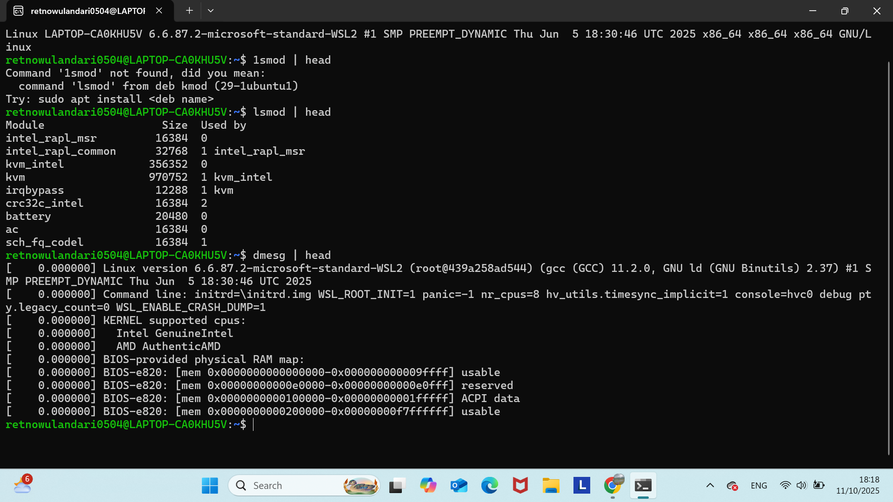
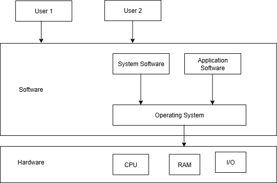

# Laporan Praktikum Minggu [1]
Topik: "Arsitektur Sistem Operasi dan Kernel"

---

## Identitas
- **Nama**  : [Dyah Retno Wulandari]  
- **NIM**   : [250202934]  
- **Kelas** : [IKRB]

---

## Tujuan
Tuliskan tujuan praktikum minggu ini.  

> Mahasiswa mampu menjelaskan fungsi utama sistem operasi dan peran kernel serta system call.

---

## Dasar Teori
Tuliskan ringkasan teori (3–5 poin) yang mendasari percobaan.

Pada praktikum minggu ini, mahasiswa akan mempelajari arsitektur dasar sistem operasi: bagaimana komponen OS bekerja, serta bagaimana interaksi antara user, aplikasi, kernel, dan hardware terjadi.

Mahasiswa juga diperkenalkan pada:

⦁	Perbedaan mode eksekusi kernel mode dan user mode.

⦁	Mekanisme system call (panggilan sistem).

⦁	Perbandingan model arsitektur OS seperti monolithic kernel, layered approach, dan microkernel.

Eksperimen akan dilakukan menggunakan perintah dasar Linux untuk melihat informasi kernel dan modul aktif.
---

## Langkah Praktikum
1. Langkah-langkah yang dilakukan.  
 Setup Environment

   Pastikan Linux (Ubuntu/WSL) sudah terinstal.

   Pastikan Git sudah dikonfigurasi dengan benar:

   git config --global user.name "Nama Anda"

   git config --global user.email "email@contoh.com"


2. ## Diskusi Konsep

   Baca materi pengantar tentang komponen OS.

   Identifikasi komponen yang ada pada Linux/Windows/Android.

3. ## Eksperimen Dasar 
Jalankan perintah berikut di terminal:

uname -a

whoami

lsmod | head

dmesg | head

Catat dan analisis modul kernel yang tampil.

  
4. ## Membuat Diagram Arsitektur

⦁	Buat diagram hubungan antara User → System Call → Kernel → Hardware.

⦁	Gunakan draw.io atau Mermaid.

⦁	Simpan hasilnya di:

praktikum/week1-intro-arsitektur-os/screenshots/diagram-os.png

5. ## Penulisan Laporan

⦁	Tuliskan hasil pengamatan, analisis, dan kesimpulan ke dalam laporan.md.

⦁	Tambahkan screenshot hasil terminal ke folder screenshots/.

6. ## Commit & Push

git add .

git commit -m "Minggu 1 - Arsitektur Sistem Operasi dan Kernel"

git push origin main

---

## Kode / Perintah
Tuliskan potongan kode atau perintah utama:
```bash
uname -a
lsmod | head
dmesg | head
```

---

## Hasil Eksekusi
Sertakan screenshot hasil percobaan atau diagram:



---

## Analisis
1.	Makna hasil percobaan
	uname -a, perintah uname digunakan untuk menampilkan informasi tentang sistem operasi dan kernel yang dicetak
	whoami, perintah whoami digunakan untuk menampilkan nama pengguns ysng sedang login ke sistem
	lsmod | head, perintah lsmod | head digunakan untuk menampilkan daftar modul kernel yang sedang dimuat di sistem Linux
	dmesg | head, perintah dmesg | head digubakan untuk menampilkan pesan-pesan kernel
2.	Hubungan dengan teori (fungsi kernel, system call, arsitektur OS)
	Kernel adalah inti dari sistem operasi yang berfungsi mengelola sumber daya manusia sistem seperti memori, CPU, dan perangkat I/O. Kernel bertanggungjawab atas manajemen proses, memori, dan perangkat keras.
Berdasarkan hasil percobaan yang saya lakukan uname -a menampilkan informasi tentang sistem operasi dan kernel yang digunakan. 

retnowulandari0504@LAPTOP-CA0KHU5V:~$ uname -a
Linux LAPTOP-CA0KHU5V 6.6.87.2-microsoft-standard-WSL2 #1 SMP PREEMPT_DYNAMIC Thu Jun 5 18:30:46 UTC 2025 x86_64 x86_64 x86_64 GNU/Linux

Berdasarkan kode diatas menunjukkan hasil bahwa perintah uname -a menampilkan nama kernel yang digunakan yaitu Linux, versi kernel linux yang digunakan “6.6.87.2-microsoft-standard-WSL2”. WSL2 artinya sistem Linux ini berjalan di Windows Subsystem for Linux 2 (WSL2). Hasil perintah juga menampilkan nama komputer dan tanggal waktu kompilasi kernel.

	System call adalah antarmuka antara pengguna dan kernel.
whoami digunakan untuk mendapatkan informasi atau melakukan operasi tertentu. Berdasarkan hasil percobaan yang saya lakukan whoami menampilkan informasi identitas pengguna yang sedang login.

retnowulandari0504@LAPTOP-CA0KHU5V:~$ whoami
retnowulandari0504

	Arsitektur OS
Sistem operasi Linux memiliki arsitektur monilitik dimana kernel berjalan dalam mode kernel (kernel space) dengan akses langsung ke hardware.
lsmod | head menampilkan modul-modul kernel yang sedang dimuat.

retnowulandari0504@LAPTOP-CA0KHU5V:~$ lsmod | head
Module                  Size  Used by
intel_rapl_msr         16384  0
intel_rapl_common      32768  1 intel_rapl_msr
kvm_intel             356352  0
kvm                   970752  1 kvm_intel
irqbypass              12288  1 kvm
crc32c_intel           16384  0
battery                20480  0
ac                     16384  0
sch_fq_codel           16384  1

dmesg | head menampilkan pesan-pesan dari ring buffer kernel.  
retnowulandari0504@LAPTOP-CA0KHU5V:~$ dmesg | head
[    0.000000] Linux version 6.6.87.2-microsoft-standard-WSL2 (root@439a258ad544) (gcc (GCC) 11.2.0, GNU ld (GNU Binutils) 2.37) #1 SMP PREEMPT_DYNAMIC Thu Jun  5 18:30:46 UTC 2025
[    0.000000] Command line: initrd=\initrd.img WSL_ROOT_INIT=1 panic=-1 nr_cpus=8 hv_utils.timesync_implicit=1 console=hvc0 debug pty.legacy_count=0 WSL_ENABLE_CRASH_DUMP=1
[    0.000000] KERNEL supported cpus:
[    0.000000]   Intel GenuineIntel
[    0.000000]   AMD AuthenticAMD
[    0.000000] BIOS-provided physical RAM map:
[    0.000000] BIOS-e820: [mem 0x0000000000000000-0x000000000009ffff] usable
[    0.000000] BIOS-e820: [mem 0x00000000000e0000-0x00000000000e0fff] reserved
[    0.000000] BIOS-e820: [mem 0x0000000000100000-0x00000000001fffff] ACPI data
[    0.000000] BIOS-e820: [mem 0x0000000000200000-0x00000000f7ffffff] usable


3.	Perbedaan hasil di lingkungan OS berbeda (Linux vs Windows)
Untuk menampilkan informasi tentang sistem operasi dan kernel yang digunakan pada windows menggunakan ver sedangkan pada linux menggunakan uname -a
	uname -a (Linux)

retnowulandari0504@LAPTOP-CA0KHU5V:~$ uname -a
Linux LAPTOP-CA0KHU5V 6.6.87.2-microsoft-standard-WSL2 #1 SMP PREEMPT_DYNAMIC Thu Jun  5 18:30:46 UTC 2025 x86_64 x86_64 x86_64 GNU/Linux

ver (Windows)

C:\Users\LENOVO>ver

Microsoft Windows [Version 10.0.26100.6725]
percobaan menggunakan perintah uname -a pada windows tidak bisa dilakukan

C:\Users\LENOVO>uname -a
'uname' is not recognized as an internal or external command,
operable program or batch file. 

	whoami (Linux) vs (Windows)
Linux
retnowulandari0504@LAPTOP-CA0KHU5V:~$ whoami
retnowulandari0504


Windows
C:\Users\LENOVO>whoami
laptop-ca0khu5v\lenovo

perintah whoami bisa digunakan di Linux maupun Windows

	lsmod | head (Linux) vs (Windows)
Linux
retnowulandari0504@LAPTOP-CA0KHU5V:~$ lsmod | head
Module                  Size  Used by
intel_rapl_msr         16384  0
intel_rapl_common      32768  1 intel_rapl_msr
kvm_intel             356352  0
kvm                   970752  1 kvm_intel
irqbypass              12288  1 kvm
crc32c_intel           16384  0
battery                20480  0
ac                     16384  0
sch_fq_codel           16384  1

Windows
C:\Users\LENOVO>lsmod | head
'lsmod' is not recognized as an internal or external command,
operable program or batch file.

C:\Users\LENOVO>driverquery
Module Name  Display Name           Driver Type   Link Date
============ ====================== ============= ======================
1394ohci     1394 OHCI Compliant Ho Kernel
3ware        3ware                  Kernel        19/05/2015 05:28:03
ACPI         Microsoft ACPI Driver  Kernel
AcpiAudioCom ACPI Audio Compositor  Kernel
AcpiDev      ACPI Devices driver    Kernel
acpiex       Microsoft ACPIEx Drive Kernel
acpipagr     ACPI Processor Aggrega Kernel
AcpiPmi      ACPI Power Meter Drive Kernel
acpitime     ACPI Wake Alarm Driver Kernel
ACPIVPC      Lenovo Virtual Power C Kernel        30/05/2024 13:36:31
Dst…

	dmesg | head (Linux) vs (Windows) 
perintah dmesg | head adalah perintah Linux untuk melihat pesan kernel sedangkan pada windows tidak ada perintah tunggal seperti dmesg. Pada windows ada beberapa cara untuk melihat log sistem yang mirip dengan fungsi dmesg pada Linux misalnya dengan membuka Event Viewer di pencarian Windows.


---

## Kesimpulan
Tuliskan 2–3 poin kesimpulan dari praktikum ini.

---

## Quiz
1. [Sebutkan tiga fungsi utama sistem operasi]  
   **Jawaban:**  
2. [Jelaskan perbedaan antara kernel mode dan user mode]  
   **Jawaban:**  
3. [Sebutkan contoh OS dengan arsitektur monolithic dan mickrokenel]  
   **Jawaban:**  

---

## Refleksi Diri
Tuliskan secara singkat:
- Apa bagian yang paling menantang minggu ini?  
- Bagaimana cara Anda mengatasinya?  

---

**Credit:**  
_Template laporan praktikum Sistem Operasi (SO-202501) – Universitas Putra Bangsa_
