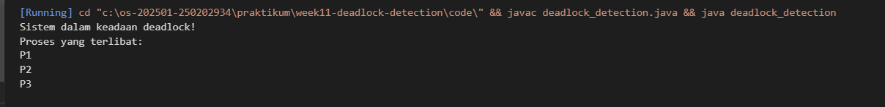

# Tugas Praktikum Minggu 11  
Topik: Simulasi dan Deteksi Deadlock

---

## Identitas
- **Nama**  : [Dyah Retno Wulandari]  
- **NIM**   : [250202934]  
- **Kelas** : [1IKRB]

## A. Deskripsi Singkat
Pada praktikum minggu ini, mahasiswa akan mempelajari **mekanisme deteksi deadlock** dalam sistem operasi.  
Berbeda dengan Minggu 7 yang berfokus pada *pencegahan dan penghindaran deadlock*, pada minggu ini mahasiswa diarahkan untuk **mendeteksi deadlock yang telah terjadi** menggunakan pendekatan algoritmik.

Mahasiswa akan membuat **program simulasi sederhana deteksi deadlock**, menjalankan dataset uji, serta menyajikan hasil analisis dalam bentuk tabel dan interpretasi logis.

---

## B. Tujuan
Setelah menyelesaikan tugas ini, mahasiswa mampu:
1. Membuat program sederhana untuk mendeteksi deadlock.  
2. Menjalankan simulasi deteksi deadlock dengan dataset uji.  
3. Menyajikan hasil analisis deadlock dalam bentuk tabel.  
4. Memberikan interpretasi hasil uji secara logis dan sistematis.  
5. Menyusun laporan praktikum sesuai format yang ditentukan.

---

## C. Ketentuan Teknis
- Bahasa pemrograman **bebas** (Python / C / Java / lainnya).  
- Program berbasis **terminal**, tidak memerlukan GUI.  
- Fokus penilaian pada **logika algoritma deteksi deadlock**, bukan kompleksitas bahasa.

Struktur folder (sesuaikan dengan template repo):
```
praktikum/week11-deadlock-detection/
├─ code/
│  ├─ deadlock_detection.*
│  └─ dataset_deadlock.csv
├─ screenshots/
│  └─ hasil_deteksi.png
└─ laporan.md
```

---

## D. Langkah Pengerjaan
1. **Menyiapkan Dataset**

   Gunakan dataset sederhana yang berisi:
   - Daftar proses  
   - Resource Allocation  
   - Resource Request / Need

   Contoh tabel:

   | Proses | Allocation | Request |
   |:--:|:--:|:--:|
   | P1 | R1 | R2 |
   | P2 | R2 | R3 |
   | P3 | R3 | R1 |

2. **Implementasi Algoritma Deteksi Deadlock**

   Program minimal harus:
   - Membaca data proses dan resource.  
   - Menentukan apakah sistem berada dalam kondisi deadlock.  
   - Menampilkan proses mana saja yang terlibat deadlock.

3. **Eksekusi & Validasi**

   - Jalankan program dengan dataset uji.  
   - Validasi hasil deteksi dengan analisis manual/logis.  
   - Simpan hasil eksekusi dalam bentuk screenshot.

4. **Analisis Hasil**

   - Sajikan hasil deteksi dalam tabel (proses deadlock / tidak).  

   | No | Proses Terlibat | Status | Keterangan |
   |:--:|:--:|:--:|:--:|
   | 1 | P1, P2, P3 | Deadlock | Terjadi circular wait|
   | 2 | P1, P2 | Tidak Deadlock | Resource dapat dilepas|
   | 3 | P2, P3, P4 | Deadlock | Saling menunggu resource|


   - Jelaskan mengapa deadlock terjadi atau tidak terjadi.  
   Jawab : *Kasus Deadlock*

     Deadlock terjadi karena setiap proses memegang minimal satu resource  dan menunggu resource lain yang sedang dipegang proses lain, sehingga tidak ada proses yang bisa lanjut.

        *Kasus Tidak Deadlock*

        Tidak terjadi deadlock karena:

        Ada proses yang dapat menyelesaikan eksekusi dan melepas resource

        Tidak terbentuk siklus tunggu (no circular wait)

   - Kaitkan hasil dengan teori deadlock (empat kondisi).

        Jawab : Deadlock terjadi karena empat kondisi deadlock terpenuhi :
   1. Mutual Exclusion

      Resource hanya bisa digunakan satu proses dalam satu waktu.

   2. Hold and Wait

      Proses memegang resource sambil menunggu resource lain.

   3. No Preemption

      Resource tidak bisa diambil paksa dari proses.

   4. Circular Wait

      Terdapat siklus proses yang saling menunggu resource.


                    import java.io.BufferedReader;
                    import java.io.FileReader;
                    import java.io.IOException;
                    import java.util.*;

                    public class deadlock_detection {

            public static void main(String[] args) {

                String fileName = "dataset_deadlock.csv";

                // Menyimpan data allocation dan request
                Map<String, String> allocation = new HashMap<>();
                Map<String, String> request = new HashMap<>();
                List<String> processes = new ArrayList<>();

                // ===== 1. MEMBACA DATA PROSES & RESOURCE =====
                try (BufferedReader br = new BufferedReader(new FileReader(fileName))) {
                    String line;
                    br.readLine(); // lewati header

                    while ((line = br.readLine()) != null) {
                        String[] data = line.split(",");

                        String process = data[0];
                        String alloc = data[1];
                        String req = data[2];

                        processes.add(process);
                        allocation.put(process, alloc);
                        request.put(process, req);
                    }
                } catch (IOException e) {
                    System.out.println("Gagal membaca file dataset!");
                    return;
                }

                // ===== 2. MEMBANGUN WAIT-FOR GRAPH =====
                Map<String, List<String>> waitForGraph = new HashMap<>();

                for (String p1 : processes) {
                    waitForGraph.put(p1, new ArrayList<>());
                    for (String p2 : processes) {
                        if (!p1.equals(p2)) {
                            if (request.get(p1).equals(allocation.get(p2))) {
                                waitForGraph.get(p1).add(p2);
                            }
                        }
                    }
                }

                // ===== 3. DETEKSI DEADLOCK =====
                Set<String> visited = new HashSet<>();
                Set<String> stack = new HashSet<>();
                Set<String> deadlockProcesses = new HashSet<>();

                for (String process : processes) {
                    if (!visited.contains(process)) {
                        dfs(process, waitForGraph, visited, stack, deadlockProcesses);
                    }
                }

                // ===== 4. OUTPUT =====
                if (!deadlockProcesses.isEmpty()) {
                    System.out.println("Sistem dalam keadaan deadlock!");
                    System.out.println("Proses yang terlibat:");
                    for (String p : deadlockProcesses) {
                        System.out.println(p);
                    }
                } else {
                    System.out.println("Tidak terjadi deadlock.");
                }
            }

            // DFS untuk mendeteksi cycle
            private static boolean dfs(
                    String process,
                    Map<String, List<String>> graph,
                    Set<String> visited,
                    Set<String> stack,
                    Set<String> deadlockProcesses) {

                visited.add(process);
                stack.add(process);

                for (String neighbor : graph.get(process)) {
                    if (!visited.contains(neighbor)) {
                        if (dfs(neighbor, graph, visited, stack, deadlockProcesses)) {
                            deadlockProcesses.add(process);
                            return true;
                        }
                    } else if (stack.contains(neighbor)) {
                        deadlockProcesses.add(process);
                        deadlockProcesses.add(neighbor);
                        return true;
                    }
                }

                stack.remove(process);
                return false;
            }
            }


   
5. **Commit & Push**

   ```bash
   git add
   git commit -m "Minggu 11 - Deadlock Detection"
   git push origin main
   ```

---

## E. Tugas & Quiz
### Tugas
1. Buat program simulasi deteksi deadlock.  
2. Jalankan program dengan dataset uji.  
3. Sajikan hasil analisis dalam tabel dan narasi.  
4. Tulis laporan praktikum pada `laporan.md`.

### Quiz
Jawab pada bagian **Quiz** di laporan:
1. Apa perbedaan antara *deadlock prevention*, *avoidance*, dan *detection*?  
   a)	Prevention : aturan ketat diterapkan sebelum proses berjalan, deadlock pasti tidak terjadi, mengorbankan efisiensi sistem
   
   b)	Avidance : membutuhkan informasi kebutuhan maksimum proses, deadlock dihindari, bukan dicegah mutlak

   c)	Detection : deadlock boleh terjadi, sistem bertindak setelah deadlock terdeteksi

2. Mengapa deteksi deadlock tetap diperlukan dalam sistem operasi?  
Jawab: Deadlock diperlukan karena :
   a)	Prevention dan avoidance tidak selalu efisien atau memungkinkan
   
   b)	Deadlock tetap bisa terjadi pada sistem kompleks

   c)	Deteksi memungkinkan pemanfaatan resource yang optimal

   d)	Menjadi dasar untuk melakukan recovery


3. Apa kelebihan dan kekurangan pendekatan deteksi deadlock?

   Kelebihan :


   a.	 Pemanfaatan resource maksimal
   
   b.	Lebih fleksibel untuk sistem dinamis

   c.	Implementasi lebih realistis

   d.	Tidak menyebabkan starvation sejak awal proses

   Kekurangan :

   
   a.	Deadlock sudah terjadi saat terdeteksi

   b.	Overhead deteksi memerlukan waktu dan sumber daya

   c.	Recovery berisiko, menghentikan proses/rollback dapat menyebabkan kehilangan data, inkosistensi sistem

   d.	Pemilihan korban (Victim selection) sulit menetukan proses mana yang harus dihentikan tidak sederhana atau salah pilih dapat merugikan proses penting
		

---

## F. Output yang Diharapkan
- Kode program deteksi deadlock di folder `code/`.  
- Dataset uji di `code/dataset_deadlock.csv`.  
- Screenshot hasil eksekusi di folder `screenshots/`.  
- Laporan lengkap di `laporan.md`.  
- Semua hasil telah di-*commit* ke GitHub.

---

## G. Referensi
1. Silberschatz, A., Galvin, P., Gagne, G. *Operating System Concepts*, 10th Ed.  
2. Tanenbaum, A. *Modern Operating Systems*, 4th Ed.  
3. OSTEP – Deadlock Detection.
