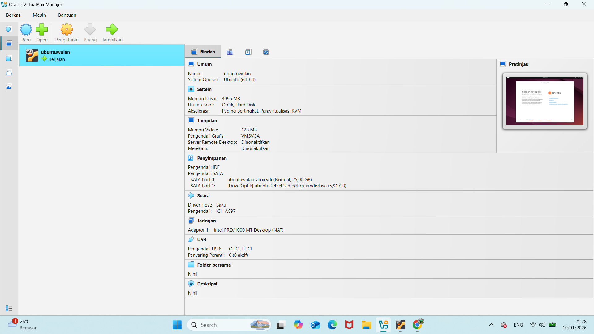
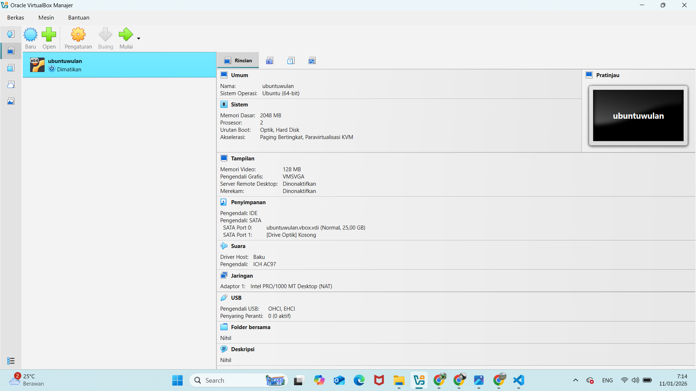
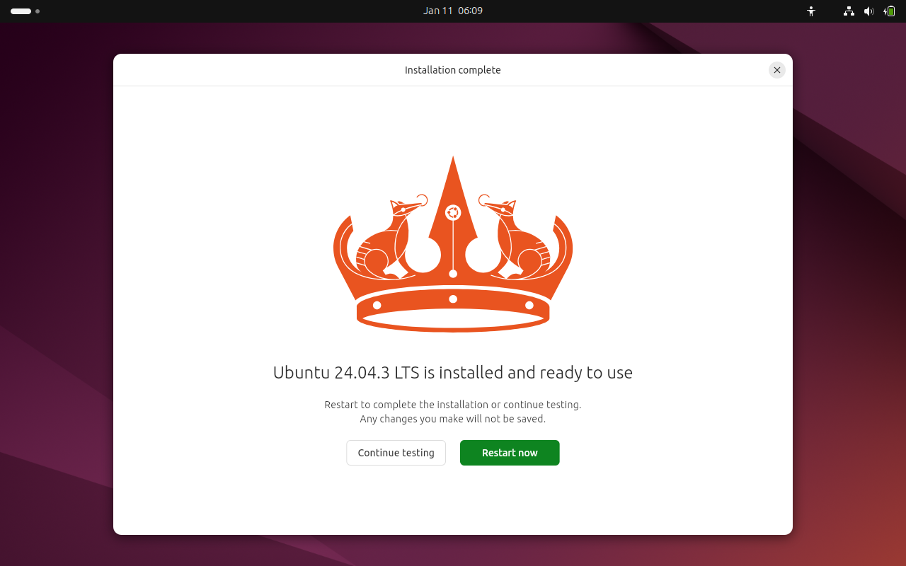
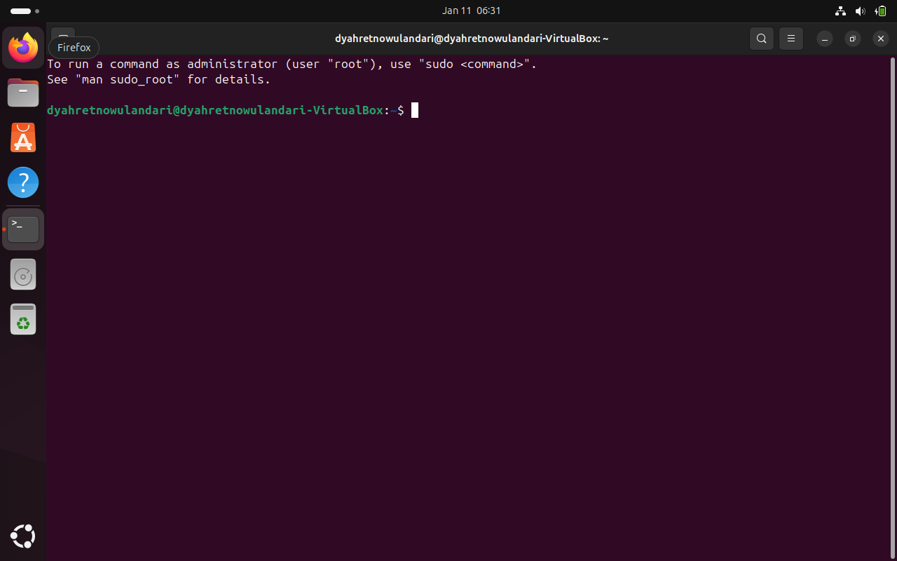
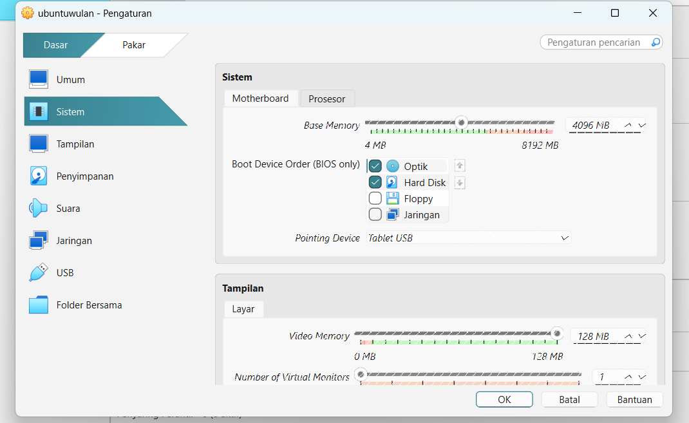

# Tugas Praktikum Minggu 12  
Topik: Virtualisasi Menggunakan Virtual Machine  

---
## Identitas
- **Nama**  : 
   1. Dyah Retno Wulandari (250202934)
   2. Erlin Dwi Cahyanti (250202911) 
- **Kelas** : [1IKRB]

## A. Deskripsi Singkat
Pada praktikum minggu ini, mahasiswa akan mempelajari konsep **virtualisasi sistem operasi** dengan menggunakan **Virtual Machine (VM)**.  
Mahasiswa diarahkan untuk menginstal dan menjalankan sistem operasi guest di atas host OS menggunakan perangkat lunak virtualisasi seperti **VirtualBox** atau **VMware**.

Praktikum ini menekankan pemahaman hubungan antara **host OS**, **guest OS**, dan **hypervisor**, serta bagaimana konfigurasi resource (CPU, memori, dan storage) memengaruhi kinerja dan isolasi sistem.

---

## B. Tujuan
Setelah menyelesaikan tugas ini, mahasiswa mampu:
1. Menginstal perangkat lunak virtualisasi (VirtualBox/VMware).  
2. Membuat dan menjalankan sistem operasi guest di dalam VM.  
3. Mengatur konfigurasi resource VM (CPU, RAM, storage).  
4. Menjelaskan mekanisme proteksi OS melalui virtualisasi.  
5. Menyusun laporan praktikum instalasi dan konfigurasi VM secara sistematis.

---

## C. Ketentuan Teknis
- Virtualisasi dapat menggunakan **VirtualBox** atau **VMware**.  
- Sistem operasi guest bebas (Linux Ubuntu direkomendasikan).  
- Praktikum dapat dilakukan secara **kelompok kecil (2–3 orang)**.

Struktur folder (sesuaikan dengan template repo):
```
praktikum/week12-virtual-machine/
├─ code/
│  └─ catatan_konfigurasi.txt (opsional)
├─ screenshots/
│  ├─ instalasi_vm.png
│  ├─ konfigurasi_resource.png
│  └─ os_guest_running.png
└─ laporan.md
```
## D. Langkah Pengerjaan
1. **Instalasi Virtual Machine**
   - Instal VirtualBox atau VMware pada komputer host.  
   - Pastikan fitur virtualisasi (VT-x / AMD-V) aktif di BIOS.

2. **Pembuatan OS Guest**
   - Buat VM baru dan pilih OS guest (misal: Ubuntu Linux).  
   - Atur resource awal:
     - CPU: 1–2 core  
     - RAM: 2–4 GB  
     - Storage: ≥ 20 GB

3. **Instalasi Sistem Operasi**
   - Jalankan proses instalasi OS guest sampai selesai.  
   - Pastikan OS guest dapat login dan berjalan normal.

4. **Konfigurasi Resource**
   - Ubah konfigurasi CPU dan RAM.  
   - Amati perbedaan performa sebelum dan sesudah perubahan resource.

   Perubahan konfigurasi:

   *Sebelum:*

   - CPU: 1 core

  -  RAM: 4096 MB

   - Storage : 25,00 GB

  

   *Sesudah:*

   - CPU: 2 core

   - RAM: 2048 MB

   - Storage : 25,00 GB (tidak berubah)
   
  
   
   *Hasil pengamatan:*

   Perubahan konfigurasi resource menunjukkan bahwa penambahan jumlah CPU core meningkatkan kemampuan pemrosesan sistem, namun pengurangan kapasitas RAM menyebabkan keterbatasan pada multitasking. Hal ini membuktikan bahwa performa mesin virtual sangat bergantung pada keseimbangan alokasi CPU dan memori.


5. **Analisis Proteksi OS**
   - Jelaskan bagaimana VM menyediakan isolasi antara host dan guest.  
   - Kaitkan dengan konsep *sandboxing* dan *hardening* OS.
   
   **Jawab:** Mesin virtual (VM) menyediakan isolasi antara host OS dan guest OS dengan cara menjalankan guest OS di atas lapisan virtualisasi (hypervisor). Guest OS tidak memiliki akses langsung ke perangkat keras host, melainkan melalui resource virtual yang dikendalikan oleh VirtualBox.

   **Isolasi Host dan Guest**

     - Kesalahan, crash, atau malware di guest OS tidak mempengaruhi host OS.

   - Akses ke CPU, RAM, disk, dan jaringan dibatasi sesuai konfigurasi VM.

   - Sistem file host tidak dapat diakses langsung tanpa fitur khusus seperti shared folder.

   **Kaitan dengan Sandboxing**

   - Virtual machine berperan sebagai sandbox, yaitu lingkungan terisolasi untuk menjalankan sistem atau aplikasi tanpa risiko langsung terhadap sistem utama. Hal ini sangat berguna untuk:

   - Uji coba sistem operasi

   - Eksperimen konfigurasi

   -  Praktikum dan simulasi

6. **Dokumentasi**
   - Ambil screenshot setiap tahap penting.  
   - Simpan di folder `screenshots/`.
   
   **Instalasi_vm**
   

   **Os_guest_running**
   

   **Konfigurasi_resource**
   

7. **Commit & Push**
   ```bash
   git add .
   git commit -m "Minggu 12 - Virtual Machine"
   git push origin main
   ```

---

## E. Tugas & Quiz
### Tugas
1. Instal dan jalankan OS guest menggunakan VM.  
2. Konfigurasikan resource VM sesuai instruksi.  
3. Dokumentasikan proses instalasi dan konfigurasi.  
4. Tulis laporan praktikum pada `laporan.md`.

### Quiz
Jawab pada bagian **Quiz** di laporan:
1. Apa perbedaan antara host OS dan guest OS?  
Jawab : **Host OS** adalah sistem operasi utama yang terpasang langsung pada perangkat keras (hardware) komputer. Host OS berfungsi mengelola sumber daya fisik seperti CPU, RAM, storage, dan perangkat input/output, serta menjadi dasar untuk menjalankan software virtualisasi.

   **Guest OS** adalah sistem operasi yang dijalankan di dalam lingkungan virtual (virtual machine) di atas host OS. Guest OS tidak berinteraksi langsung dengan hardware, melainkan melalui lapisan virtualisasi yang disediakan oleh hypervisor.

2. Apa peran hypervisor dalam virtualisasi?  
Jawab : Hypervisor adalah perangkat lunak (atau firmware) yang berfungsi untuk:

   •	Membuat dan mengelola virtual machine (VM)

   •	Membagi dan mengalokasikan sumber daya hardware (CPU, RAM, storage) ke setiap VM

   •	Menjaga agar setiap VM (guest OS) berjalan secara terisolasi satu sama lain

3. Mengapa virtualisasi meningkatkan keamanan sistem?  
Jawab : Karena

   •	Isolasi sistem: Jika satu guest OS terkena virus atau crash, guest OS lain dan host OS tetap aman.

   •	Pembatasan akses hardware: Guest OS tidak memiliki akses langsung ke hardware, sehingga risiko kerusakan sistem lebih kecil.

   •	Mudah melakukan pemulihan: Snapshot dan cloning VM memungkinkan sistem dikembalikan ke kondisi sebelumnya dengan cepat jika terjadi serangan atau kesalahan.

   •	Lingkungan uji coba aman: Aplikasi berisiko dapat diuji di VM tanpa membahayakan sistem utama.

---

## F. Output yang Diharapkan
- Screenshot instalasi dan konfigurasi VM.  
- Laporan lengkap instalasi dan analisis VM di `laporan.md`.  
- Semua hasil telah di-*commit* ke GitHub.

---

## G. Referensi
1. Silberschatz, A., Galvin, P., Gagne, G. *Operating System Concepts*, 10th Ed.  
2. Tanenbaum, A. *Modern Operating Systems*, 4th Ed.  
3. Oracle VirtualBox Documentation.  
4. OSTEP – Virtualization.  
