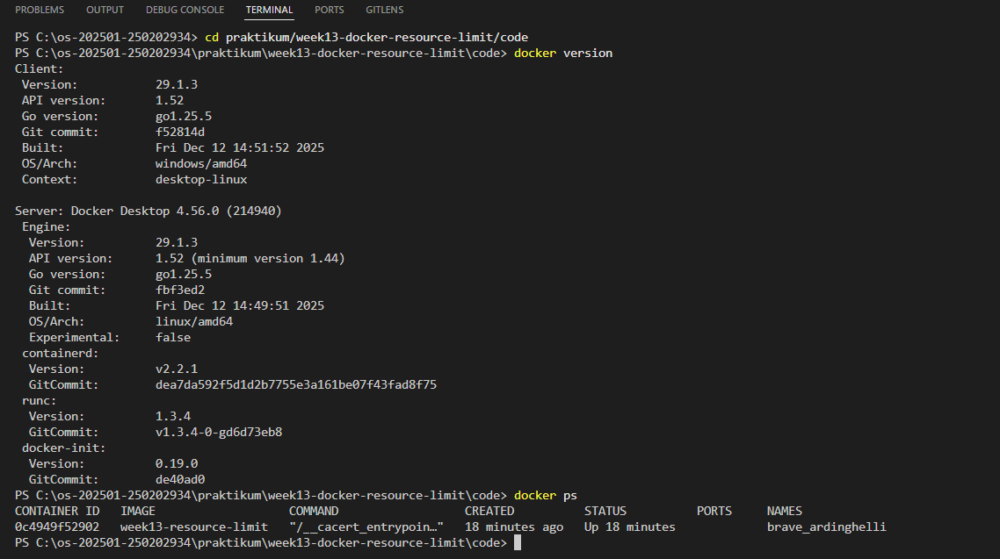
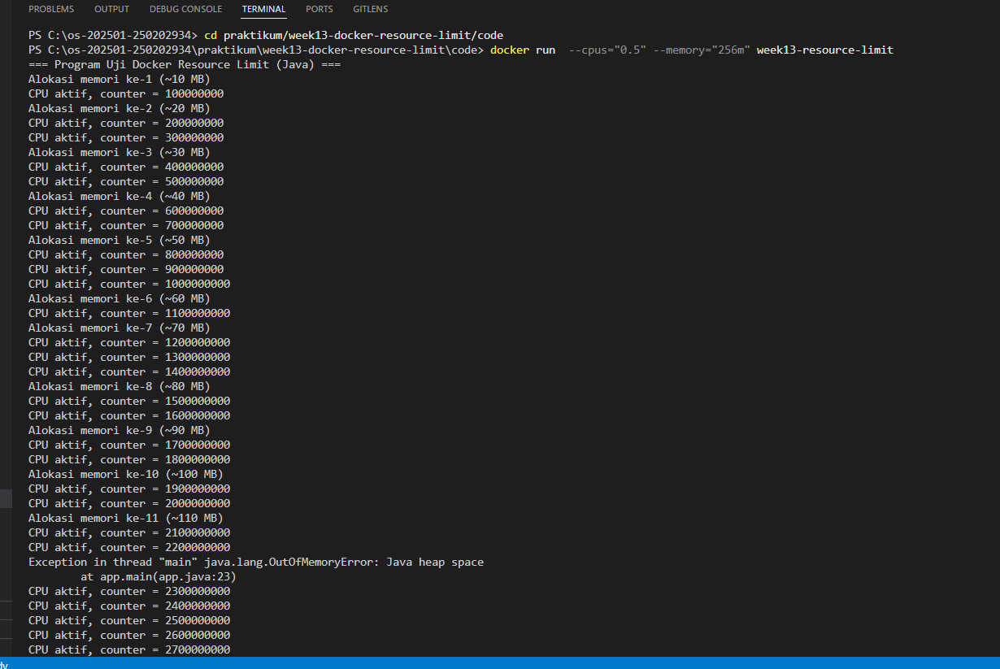
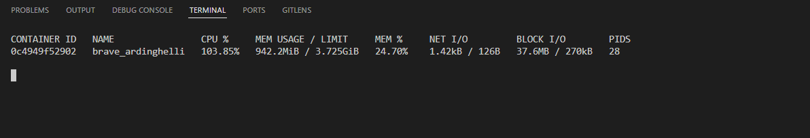
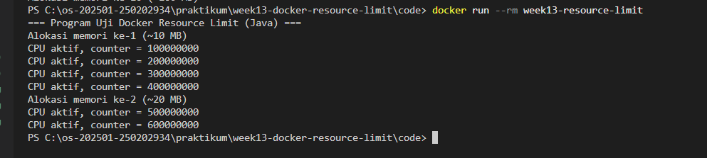

# Tugas Praktikum Minggu 13  
Topik: Docker – Resource Limit (CPU & Memori)

---

## Identitas
- **Nama**  : [Dyah Retno Wulandari]  
- **NIM**   : [250202934]  
- **Kelas** : [1IKRB]
 
## A. Deskripsi Singkat
Pada praktikum minggu ini, mahasiswa mempelajari konsep **containerization** menggunakan Docker, serta bagaimana sistem operasi membatasi pemakaian sumber daya proses melalui mekanisme isolasi dan kontrol resource (mis. *cgroups* pada Linux).

Fokus praktikum adalah:
1. Membuat **Dockerfile sederhana** untuk menjalankan aplikasi/skrip.
2. Menjalankan container dengan **pembatasan resource** (CPU dan memori).
3. Mengamati dampak pembatasan resource melalui output program dan monitoring sederhana.

---

## B. Tujuan
Setelah menyelesaikan tugas ini, mahasiswa mampu:
1. Menulis Dockerfile sederhana untuk sebuah aplikasi/skrip.
2. Membangun image dan menjalankan container.
3. Menjalankan container dengan pembatasan **CPU** dan **memori**.
4. Mengamati dan menjelaskan perbedaan eksekusi container dengan dan tanpa limit resource.
5. Menyusun laporan praktikum secara runtut dan sistematis.

---

## C. Ketentuan Teknis
- Sistem operasi host bebas (Windows/macOS/Linux). Disarankan memakai **Docker Desktop** (atau Docker Engine di Linux).
- Program berbasis **terminal**.
- Fokus penilaian pada **keberhasilan build & run container**, **penerapan resource limit**, serta **kualitas analisis**.

Struktur folder (sesuaikan dengan template repo):
```
praktikum/week13-docker-resource-limit/
├─ code/
│  ├─ Dockerfile
│  └─ app.*
├─ screenshots/
│  └─ hasil_limit.png
└─ laporan.md
```

---

## D. Langkah Pengerjaan
1. **Persiapan Lingkungan**

   - Pastikan Docker terpasang dan berjalan.
   - Verifikasi:
     ```bash
     docker version
     docker ps
     ```
      

2. **Membuat Aplikasi/Skrip Uji**

   Buat program sederhana di folder `code/` (bahasa bebas) yang:
   - Melakukan komputasi berulang (untuk mengamati limit CPU), dan/atau
   - Mengalokasikan memori bertahap (untuk mengamati limit memori).

3. **Membuat Dockerfile**

   - Tulis `Dockerfile` untuk menjalankan program uji.
   - Build image:
     ```bash
     docker build -t week13-resource-limit .
     ```

4. **Menjalankan Container Tanpa Limit**

   - Jalankan container normal:
     ```bash
     docker run --rm week13-resource-limit
     ```
   - Catat output/hasil pengamatan.

5. **Menjalankan Container Dengan Limit Resource**

   Jalankan container dengan batasan resource (contoh):
   ```bash
   docker run --rm --cpus="0.5" --memory="256m" week13-resource-limit
   ```
   Catat perubahan perilaku program (mis. lebih lambat, error saat memori tidak cukup, dll.).

6. **Monitoring Sederhana**

   - Jalankan container (tanpa `--rm` jika perlu) dan amati penggunaan resource:
      


      
     ```bash
     docker stats
     ```
   - Ambil screenshot output eksekusi dan/atau `docker stats`.


7. **Commit & Push**

   ```bash
   git add .
   git commit -m "Minggu 13 - Docker Resource Limit"
   git push origin main
   ```

---

## E. Tugas & Quiz
### Tugas
1. Buat Dockerfile sederhana dan program uji di folder `code/`.


2. Build image dan jalankan container **tanpa limit**.


3. Jalankan container dengan limit **CPU** dan **memori**.


4. Sajikan hasil pengamatan dalam tabel/uraian singkat di `laporan.md`.

Tabel Perbandingan Hasil
<table>
<th>
<tr>
<td>Kondisi</td>	
<td>CPU</td>	
<td>Memori</td>	
<td>Perilaku Program</td>
</tr>
</th>
<tr>
<td>Tanpa Limit</td>	
<td>Bebas</td>	
<td>Bebas</td>
<td>Berjalan cepat dan stabil</td>
</tr>
<tr>
<td>Dengan Limit</td>	
<td>±50%	</td>
<td>256 MB </td>	
<td>Lebih lambat, resource terbatas</td>
</tr>
</table>


### Quiz
Jawab pada bagian **Quiz** di laporan:
1. Mengapa container perlu dibatasi CPU dan memori?

   Jawab : 
   -  Mencegah satu container menghabiskan seluruh resource host, yang dapat menyebabkan container lain atau sistem host menjadi lambat atau crash.

   - Menjaga stabilitas sistem, terutama saat banyak container berjalan bersamaan.
   - Mendukung manajemen resource yang adil, sehingga setiap aplikasi mendapat jatah sesuai kebutuhan.
Mengurangi risiko gangguan layanan (Denial of Service) akibat aplikasi yang tidak terkontrol.

2. Apa perbedaan VM dan container dalam konteks isolasi resource?

   Jawab:

   •	Virtual Machine (VM) menggunakan isolasi berbasis hardware virtual, di mana setiap VM memiliki guest OS sendiri. Isolasi resource lebih kuat, tetapi membutuhkan resource lebih besar.

   •	Container menggunakan isolasi berbasis kernel host, berbagi kernel yang sama dengan host OS. Isolasi resource lebih ringan dan efisien, namun tidak sekuat VM.

3. Apa dampak limit memori terhadap aplikasi yang boros memori?

   Jawab:  Jika aplikasi boros memori diberi limit memori:

   •	Aplikasi dapat mengalami OOM (Out Of Memory) dan dihentikan secara otomatis.

   •	Performa aplikasi menurun karena tidak mendapatkan memori yang cukup.

   •	Sistem host tetap terlindungi dari crash, karena penggunaan memori dibatasi.

---

## F. Output yang Diharapkan
- File `Dockerfile` dan kode program uji di `praktikum/week13-docker-resource-limit/code/`.
- Screenshot hasil eksekusi/monitoring di `praktikum/week13-docker-resource-limit/screenshots/`.
- Laporan lengkap pada `praktikum/week13-docker-resource-limit/laporan.md`.
- Semua hasil telah di-*commit* ke GitHub.

---

## G. Referensi
1. Docker Documentation – Resource constraints (CPU/Memory).  
2. Linux Kernel Docs – Control Groups (cgroups) dan namespaces.  
3. OSTEP – Virtualization / Resource Management.