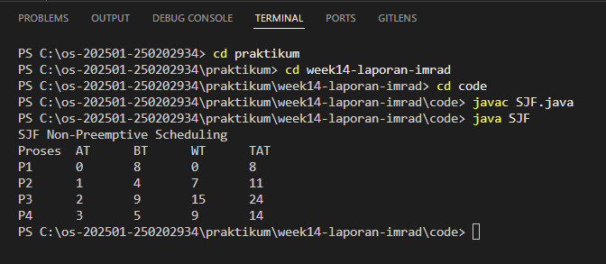
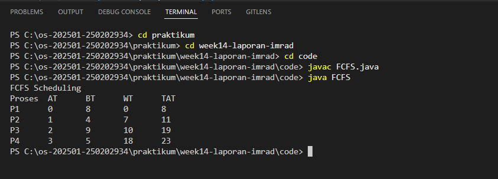

# Tugas Praktikum Minggu 14  
Topik: Penyusunan Laporan Praktikum Format IMRAD

---

## Identitas
- **Nama**  : [Dyah Retno Wulandari]  
- **NIM**   : [250202934]  
- **Kelas** : [1IKRB]

## A. Deskripsi Singkat
Pada pertemuan ini, mahasiswa menyusun **laporan praktikum ilmiah** secara sistematis menggunakan format **IMRAD** (*Introduction, Methods, Results, and Discussion*) yang ditutup dengan **Kesimpulan**.

Laporan IMRAD digunakan untuk merangkum praktikum-praktikum sebelumnya (mis. scheduling, page replacement, deadlock detection, VM/Docker) agar hasil uji dapat dipahami, direplikasi, dan dievaluasi secara akademik.

---

## B. Tujuan
Setelah menyelesaikan tugas ini, mahasiswa mampu:
1. Menyusun laporan praktikum dengan struktur ilmiah (Pendahuluan–Metode–Hasil–Pembahasan–Kesimpulan).
2. Menyajikan hasil uji dalam bentuk tabel dan/atau grafik yang jelas.
3. Menuliskan analisis hasil dengan argumentasi yang logis.
4. Menyusun sitasi dan daftar pustaka dengan format yang konsisten.
5. Mengunggah draft laporan ke repositori dengan rapi dan tepat waktu.

---

## C. Ketentuan Teknis
- Laporan ditulis dalam `Markdown` pada file `laporan.md`.
- Topik laporan boleh memilih salah satu dari praktikum sebelumnya:
  - Scheduling (FCFS/SJF)
  - Page Replacement (FIFO/LRU)
  - Deadlock Detection
  - VM/Docker (resource management)
- Wajib menyertakan minimal:
  - 1 tabel hasil (atau lebih)
  - 1 gambar (screenshot, diagram, atau grafik)
  - sitasi dan daftar pustaka

Struktur folder (sesuaikan dengan template repo):
```
praktikum/week14-laporan-imrad/
├─ code/
│  └─ (opsional) file kode/data pendukung
├─ screenshots/
│  ├─ (wajib) bukti hasil uji
│  └─ (opsional) grafik/diagram
└─ laporan.md
```

---

## D. Langkah Pengerjaan
1. **Menentukan Topik Laporan**

   Pilih 1 topik dari praktikum sebelumnya (mis. Minggu 9/10/11/13) dan tetapkan tujuan eksperimen yang ingin disampaikan.

2. **Menyiapkan Bahan**

   - Kode/program yang digunakan.
   - Dataset/parameter uji (jika ada).
   - Bukti hasil eksekusi (screenshot) dan/atau grafik.

3. **Menulis Laporan dengan Struktur IMRAD**

   Tulis `praktikum/week14-laporan-imrad/laporan.md` dengan struktur minimal berikut:
   - **Pendahuluan (Introduction):** latar belakang, rumusan masalah/tujuan.
   - **Metode (Methods):** lingkungan uji, langkah eksperimen, parameter/dataset, cara pengukuran.
   - **Hasil (Results):** tabel/grafik hasil uji, ringkasan temuan.
   - **Pembahasan (Discussion):** interpretasi hasil, keterbatasan, perbandingan teori/ekspektasi.
   - **Kesimpulan:** 2–4 poin ringkas menjawab tujuan.

4. **Menyajikan Tabel/Grafik**

   - Tabel harus diberi judul/keterangan singkat.
   - Jika menggunakan grafik: jelaskan sumbu dan arti grafik.

5. **Sitasi dan Daftar Pustaka**

   - Cantumkan referensi minimal 2 sumber.
   - Gunakan format konsisten (mis. daftar bernomor).

6. **Commit & Push Draft**

   ```bash
   git add .
   git commit -m "Minggu 14 - Draft Laporan IMRAD"
   git push origin main
   ```
---

# Laporan Praktikum Scheduling CPU (FCFS & SJF)
## 1. Pendahuluan

   Scheduling CPU adalah mekanisme sistem operasi untuk menentukan urutan eksekusi proses yang berada dalam keadaan siap (ready). Penjadwalan yang baik bertujuan untuk meningkatkan efisiensi CPU, memperkecil waktu tunggu, dan meningkatkan throughput sistem.
   
   Pada laporan ini dibahas dua algoritma penjadwalan CPU, yaitu First Come First Serve (FCFS) dan Shortest Job First (SJF), beserta perbandingan hasil kinerjanya.

## 2. Tujuan Praktikum

Tujuan dari praktikum ini adalah:

•	Memahami konsep dasar scheduling CPU.

•	Mengimplementasikan algoritma FCFS dan SJF.

•	Menganalisis perbedaan performa berdasarkan waktu tunggu dan waktu penyelesaian.

## 3. Dasar Teori
**3.1 First Come First Serve (FCFS)**

   FCFS adalah algoritma penjadwalan non-preemptive di mana proses dieksekusi berdasarkan urutan kedatangan. Proses yang datang lebih awal akan dieksekusi terlebih dahulu.

   *Kelebihan:*

   •	Implementasi sederhana

   •	Tidak menyebabkan starvation

   *Kekurangan:*

   •	Rata-rata waktu tunggu bisa besar

**3.2 Shortest Job First (SJF)**

SJF adalah algoritma penjadwalan yang mengeksekusi proses dengan burst time paling pendek terlebih dahulu.

Kelebihan:

•	Rata-rata waktu tunggu minimum

Kekurangan:

•	Berpotensi menyebabkan starvation

•	Sulit memprediksi burst time

# 4. Data dan Metodologi**

**4.1 Dataset Proses**

Contoh data proses yang digunakan dalam praktikum:

 | Proses | Arrival Time | Burst Time | 
   |:--:|:--:|:--:| 
   | P1 | 0 | 8 |
   | P2 | 1 | 4 |
   | P3 | 2 | 9 |
   | P4 | 3 | 5 |

**4.2 Metode Pengujian**

•	Menjalankan algoritma FCFS dan SJF menggunakan dataset di atas

•	Menghitung Waiting Time dan Turnaround Time

•	Membandingkan hasil kedua algoritma

# 5. Hasil dan Pembahasan
**5.1 Hasil Penjadwalan FCFS**

Gantt Chart:

       | P1 | P2 | P3 | P4 |
         0    8    12   21   26

Hasil perhitungan Tabel Manual

| Proses | Waiting Time | Turnaround Time|
   |:--:|:--:|:--:|
   | P1 | 0 | 8 |
   | P2 | 7 | 11 |
   | P3 | 10 | 19 |
   | P4 | 18 | 23 |
   Rata-rata Waiting Time FCFS = 8.75


Hasil perhitungan menggunakan bahasa pemograman Java
   
   

**5.2 Hasil Penjadwalan SJF**

Gantt Chart:

         | P1 | P2 | P4 | P3 |
         0    8    12   17   26

Hasil perhitungan SJF

| Proses | Waiting Time | Turnaround Time|
   |:--:|:--:|:--:|
   | P2 | 0 |4 |
   | P4 | 3 | 8  |
   | P1 | 8 | 16 |
   | P3 | 16 | 25 |

   Rata-rata Waiting Time SJF = 6.75

Hasil perhitungan menggunakan bahasa pemograman Java

   

**5.3 Pembahasan**

   Pada algoritma FCFS, proses dieksekusi berdasarkan urutan waktu kedatangan. Proses P1 dieksekusi terlebih dahulu karena memiliki arrival time paling awal. Proses dengan burst time yang besar dapat menyebabkan proses lain menunggu lebih lama, sehingga waiting time pada P4 menjadi yang terbesar.

   Pada algoritma SJF non-preemptive, pemilihan proses dilakukan berdasarkan burst time paling kecil dari proses yang telah tiba. Hal ini menyebabkan rata-rata waiting time lebih kecil dibandingkan FCFS karena proses dengan durasi pendek diprioritaskan.

   Perbandingan hasil menunjukkan bahwa algoritma SJF lebih efisien dalam menurunkan waktu tunggu rata-rata, namun memiliki potensi starvation terhadap proses dengan burst time besar apabila proses pendek terus berdatangan.

## 6. Analisis
   Berdasarkan hasil penjadwalan, algoritma SJF non-preemptive menghasilkan rata-rata waiting time dan turnaround time yang lebih rendah dibandingkan FCFS. Hal ini menunjukkan bahwa SJF lebih efisien dalam meminimalkan waktu tunggu proses, terutama ketika terdapat variasi burst time yang signifikan.

   Namun, algoritma SJF memiliki kelemahan yaitu potensi terjadinya starvation pada proses dengan burst time besar. Proses seperti P3 memiliki waiting time yang cukup tinggi karena selalu kalah prioritas dibandingkan proses dengan burst time yang lebih kecil. Kondisi ini dapat menjadi masalah pada sistem nyata apabila proses pendek terus berdatangan.

   Sebaliknya, algoritma FCFS bersifat adil karena melayani proses berdasarkan urutan kedatangan, namun kurang efisien dalam hal waktu tunggu. Proses dengan burst time besar yang datang lebih awal dapat menyebabkan peningkatan waiting time pada proses berikutnya.
   

## 7. Kesimpulan
   •	FCFS mudah diimplementasikan tetapi kurang efisien dalam waktu tunggu.

   •	SJF lebih optimal dalam performa tetapi memiliki risiko starvation.

   •	Pemilihan algoritma scheduling harus disesuaikan dengan kebutuhan sistem.

## 8. Daftar Pustaka
1.	Silberschatz, A., Galvin, P. B., & Gagne, G. (2018). Operating System Concepts. Wiley.
2.	Tanenbaum, A. S., & Bos, H. (2015). Modern Operating Systems. Pearson.
3.	Stallings, W. (2018). Operating Systems: Internals and Design Principles. Pearson.


## E. Tugas & Quiz
### Tugas
1. Susun laporan praktikum format IMRAD di `praktikum/week14-laporan-imrad/laporan.md`.
2. Sertakan minimal 1 tabel dan 1 gambar (screenshot/grafik).
3. Sertakan sitasi dan daftar pustaka.
4. Pastikan struktur folder rapi sesuai ketentuan.

### Quiz
Jawab pada bagian **Quiz** di laporan:
1. Mengapa format IMRAD membantu membuat laporan praktikum lebih ilmiah dan mudah dievaluasi?
   Jawab: Format IMRAD (Introduction, Methods, Results, and Discussion) membantu karena struktur logis & standar ilmiah. Memisahkan fakta dan analisis, data disajikan apa adanya (Hasil), interpretasi ada di Pembahasan. MMeningkatkan reprodusibilitas, metode dijelaskan rinci sehingga praktikum bisa diulang.

2. Apa perbedaan antara bagian **Hasil** dan **Pembahasan**?

   | Hasil                 | Pembahasan                  |
   | --------------------- | --------------------------- |
   | Menyajikan data       | Menjelaskan makna data      |
   | Objektif (apa adanya) | Analitis & interpretatif    |
   | Tabel, grafik, output | Alasan, perbandingan, teori |
   | Tidak ada opini       | Boleh ada analisis          |

3. Mengapa sitasi dan daftar pustaka penting, bahkan untuk laporan praktikum?

   Jawab: Karena menunjukkan dasar teori yang valid (buku/jurnal, bukan opini pribadi), menghindari plagiarisme, meningkatkan kredibilitas ilmiah laporan, memudahkan verifikasi jika pembaca ingin mengecek sumber asli.

---

## F. Output yang Diharapkan
- File `praktikum/week14-laporan-imrad/laporan.md` berisi laporan format IMRAD.
- Bukti hasil uji (screenshot/grafik) tersimpan di `praktikum/week14-laporan-imrad/screenshots/`.
- (Opsional) kode/data pendukung di `praktikum/week14-laporan-imrad/code/`.
- Semua perubahan telah di-*commit* dan di-*push*.

---

## G. Referensi
1. Silberschatz, A., Galvin, P., Gagne, G. *Operating System Concepts*, 10th Ed.
2. Tanenbaum, A. *Modern Operating Systems*, 4th Ed.
3. OSTEP – referensi sesuai topik praktikum yang dipilih.
