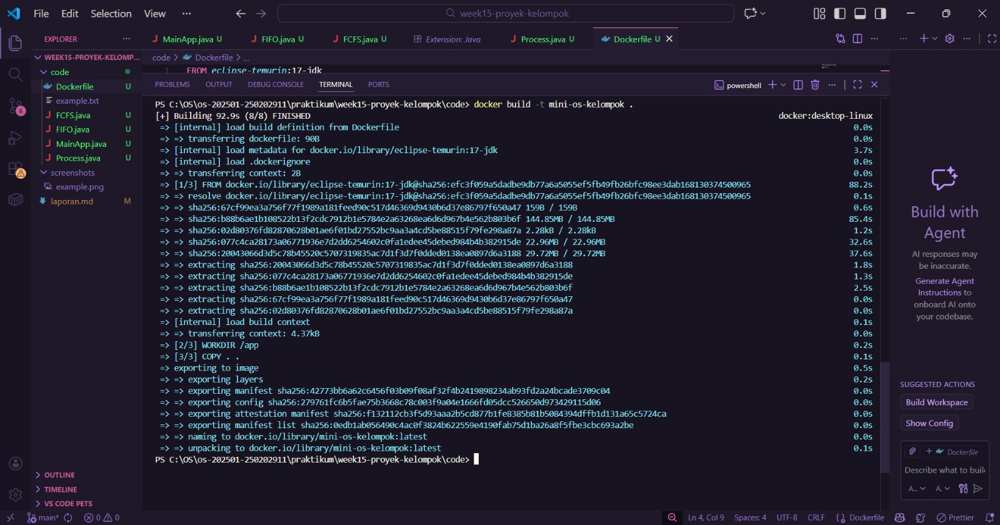
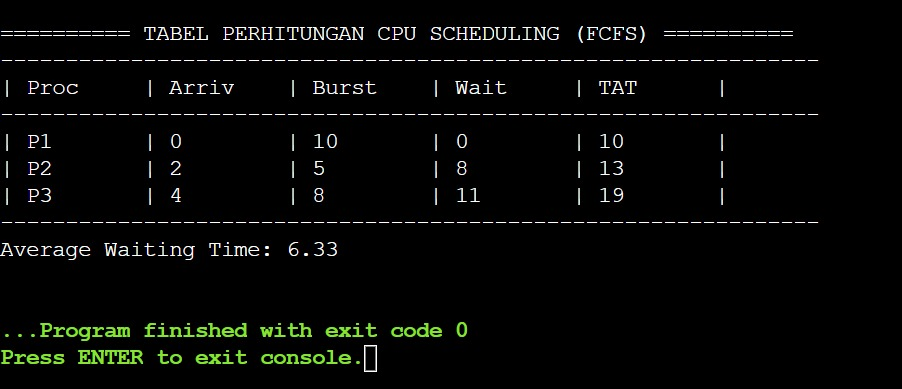
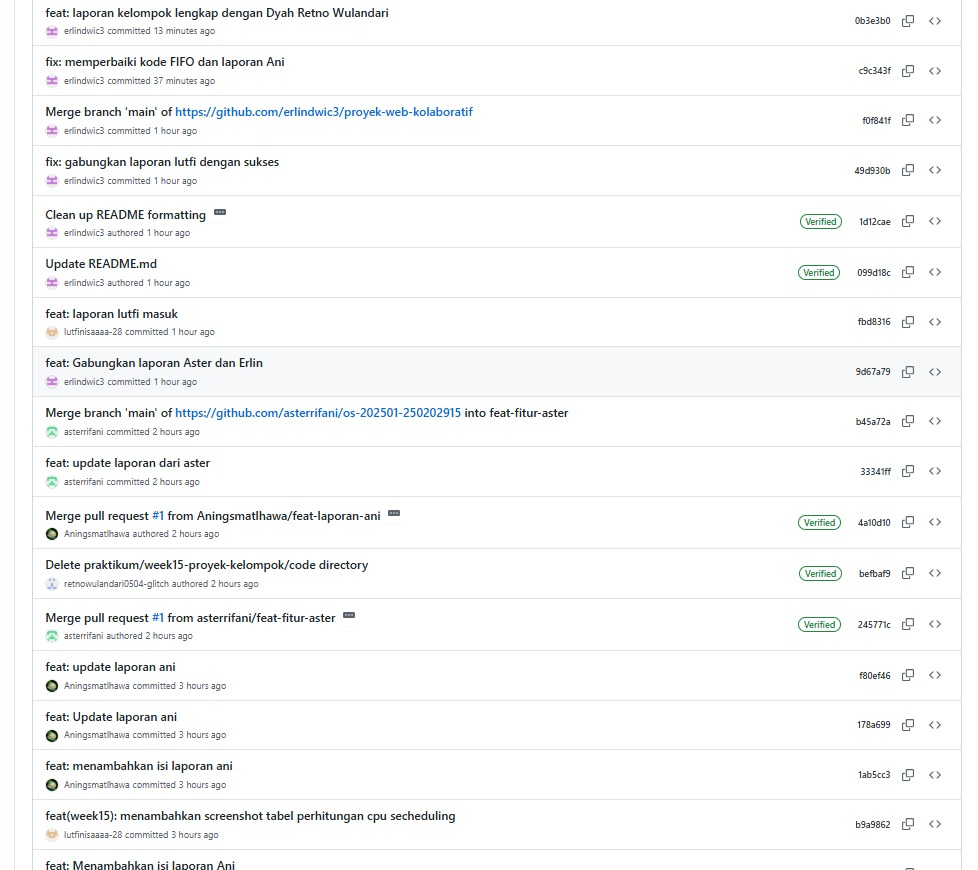

# Tugas Praktikum Minggu 15  
Topik: Proyek Kelompok – Mini Simulasi Sistem Operasi (Scheduling + Memory + Container)

---
- **Nama Anggota Kelompok:**  
1. Erlin Dwi Cahyanti   (250202911)
2. Ani Ngismatul Hawa   (250202914)
3. Aster Rifani         (250202915)
4. Dyah Retno Wulandari (250202934)
5. Lutfi Khoerunnisa    (250202947)
- **Kelas** : [1IKRB]

## Laporan Proyek Kelompok: Mini Simulasi Sistem Operasi ##
# 1. Pendahuluan
**A.	Latar Belakang**

  Sistem Operasi (Operating System) memiliki peran penting dalam mengelola sumber daya komputer seperti CPU, memori, dan proses. Pada proyek ini dilakukan simulasi dua konsep utama Sistem Operasi, yaitu:

- CPU Scheduling (FCFS dan SJF)
- Page Replacement (FIFO dan LRU)

Simulasi dibuat menggunakan bahasa pemrograman Java berbasis terminal dan dijalankan di dalam Docker untuk memastikan environment yang reproducible. Proyek dikerjakan menggunakan Git kolaboratif dengan pembagian branch per fitur. Mini Simulasi Sistem Operasi merupakan studi komprehensif yang mengintegrasikan tiga pilar utama infrastruktur TI modern. 
1. Pertama, Manajemen Memori melalui perbandingan algoritma FIFO dan LRU untuk mengoptimalkan efisiensi page replacement . 
2. Kedua, Scheduling yang mengatur antrean proses agar sistem berjalan responsif. 
3. Ketiga, Containerization (Docker) yang digunakan untuk mensimulasikan limitasi sumber daya CPU dan RAM secara nyata, memastikan aplikasi berjalan stabil di lingkungan terisolasi tanpa mengganggu host utama.

---

## B. Tujuan
Tujuan dari proyek ini, berdasarkan panduan praktikum, adalah sebagai berikut:
1.	Bekerja dalam tim: Kemampuan berkolaborasi dalam kelompok dengan pembagian tugas yang jelas antara peran Lead, Developer, dan QA.
2.	Menggabungkan konsep: Mampu mengintegrasikan setidaknya dua konsep inti dari Sistem Operasi (misalnya pengaturan CPU dan penggantian halaman memori) ke dalam satu program yang sama.
3.	Mengelola kode: Menggunakan Git untuk mengelola kode dengan baik, termasuk pembuatan dan penggabungan branch secara rapi.
4.	Memastikan aplikasi bisa dijalankan: Menggunakan Docker agar aplikasi dapat dijalankan dengan lancar di berbagai lingkungan.
5.	Membuat dokumentasi dan presentasi: Membuat dokumentasi yang terstruktur serta menyampaikan hasil pengujian aplikasi melalui presentasi yang jelas.

---
# 2. Arsitektur Aplikasi
**A. Desain Arsitektur Umum**

  Arsitektur umum Mini Simulasi Sistem Operasi ini dibangun di atas tiga lapisan integrasi yang menghubungkan logika algoritma dengan lingkungan eksekusi modern. Pada lapisan inti, Logika Manajemen Memori dan Penjadwalan berfungsi sebagai otak sistem yang memproses antrean data menggunakan algoritma seperti FIFO atau LRU serta mengatur prioritas tugas. Logika ini kemudian dibungkus dalam Lapisan Kontainerisasi (Docker), yang bertindak sebagai lingkungan terisolasi untuk mengatur batas penggunaan sumber daya fisik, seperti membatasi kapasitas CPU dan RAM agar simulasi tidak mengonsumsi seluruh daya host.

  Aliran datanya dimulai dari input proses yang dijadwalkan oleh unit scheduling, lalu dialokasikan ke unit memory management untuk dipetakan ke dalam slot memori yang tersedia, sementara seluruh aktivitas tersebut dipantau secara real-time melalui metrik performa kontainer.

**B. Deskripsi Modul**

  Aplikasi simulasi Sistem Operasi ini dibagi menjadi beberapa modul terpisah untuk menjaga struktur kode tetap rapi, mudah dipahami, dan mudah dikembangkan. Setiap modul merepresentasikan satu konsep atau fungsi utama dalam Sistem Operasi.

2.1 Modul CPU Scheduling


| Komponen   | Keterangan                                                                            |
| ---------- | ------------------------------------------------------------------------------------- |
| Nama Modul | Scheduling                                                                            |
| File Utama | FCFS.java, SJF.java, Process.java                                                     |
| Deskripsi  | Mensimulasikan penjadwalan proses pada CPU                                            |
| Algoritma  | 1. First Come First Serve (FCFS). 2. Shortest Job First (SJF-non-preemptiva)          |
| Input      | Data set proses (PID, Arrival Time, Burst Time)                                       |
| Output     | 1. Tabel hasil metrik per proses. 2. Ringkasan metrik (Avg Waiting & Turnaround Time) |

Fungsi Utama:

  - Membaca data proses dari file process.csv
  - Mengurutkan proses sesuai algoritma yang dipilih
  - Menghitung: Waiting Time Turnaround Time Rata-rata Waiting Time   
  - Menampilkan hasil dalam bentuk tabel ASCII di terminal.

  Input: Dataset proses (PID, Arrival Time, Burst Time)

  Output: Tabel hasil per proses Ringkasan metrik penjadwalan

2.2 Modul Page Replacement

  Nama Modul: paging 
  File Utama: FIFO.java, LRU.java

Deskripsi: 
  Modul Page Replacement digunakan untuk mensimulasikan penggantian halaman pada memori utama dengan algoritma FIFO (First In First Out) dan LRU (Least Recently Used).

| Komponen   | Keterangan                                                                          |
| ---------- | ----------------------------------------------------------------------------------- |
| Nama Modul | paging                                                                              |
| File Utama | "FIFO.java, LRU.java"                                                               |
| Deskripsi  | Mensimulasikan penggantian halaman pada memori utama (Virtual Memory)               |
| Algoritma  | 1. First-In First-Out (FIFO). 2. Least Recently Used (LRU)                          |
| Input      | 1. Jumlah Frame (Input CLI). 2. Dataset referensi halaman (pages.txt)               |
| Output     | "1. Tabel status Hit/Fault per referensi. 2. Ringkasan (Total Fault, Fault Rate %)" |

Fungsi Utama:
  - Membaca urutan referensi halaman dari file pages.txt
  - Menerima input jumlah frame dari pengguna melalui CLI
  - Menentukan page hit dan page fault
  - Menghitung fault rate

  Input:
  - Jumlah frame
  - Dataset referensi halaman
  Output:
  - Total page reference
  - Jumlah page fault
  - Jumlah page hit
  - Fault rate (%)

  ## Alur Data

Alur data dalam Mini Simulasi Sistem Operasi ini bergerak secara linier dari input pengguna hingga pemantauan sistem, yang dapat dijelaskan dalam empat tahap utama:

  1. Input & Penjadwalan (Scheduling): Data atau proses masuk ke dalam sistem dan diatur urutan eksekusinya oleh unit scheduling. Di sini, sistem menentukan kapan sebuah proses mendapatkan giliran untuk diproses oleh CPU.
  2. Alokasi Memori (Memory Management): Setelah proses dijadwalkan, sistem akan mengakses data di memori. Pada tahap ini, algoritma FIFO atau LRU bekerja untuk memutuskan data mana yang harus tetap berada di 3 slot frame dan data mana yang harus diganti jika terjadi page fault .
  3. Eksekusi Terisolasi (Containerization): Seluruh proses komputasi ini berjalan di dalam Kontainer Docker. Docker memastikan bahwa simulasi hanya menggunakan sumber daya sesuai limit yang ditentukan, misalnya CPU maksimal 50% dan RAM 256 MiB.

  4. Monitoring & Output: Hasil akhir berupa jumlah fault dan hit ditampilkan sebagai output, sementara beban kerja sistem dipantau secara real-time melalui metrik performa (CPU/RAM Usage) untuk memvalidasi stabilitas arsitektur.

## Langkah Praktikum

  1. Inisialisasi Proyek: Membuat struktur folder kerja dan menyiapkan file sumber Java (MainApp, Process, FCFS, FIFO).

  2. Persiapan Data: Menyusun file proses.csv di dalam folder data sebagai input otomatis untuk simulasi penjadwalan CPU.

  3. Konfigurasi Docker: Membuat Dockerfile dan melakukan build image mini-os-kelompok menggunakan basis JDK 17.

  4. Penanganan Error: Mengatasi kendala INTERNAL_ERROR pada Docker dengan melakukan restart layanan dan pembersihan cache.

  5. Simulasi CPU Scheduling: Menjalankan program untuk menghitung algoritma FCFS dan menghasilkan Average Waiting Time sebesar 6.33.

  6. Simulasi Page Replacement: Menjalankan algoritma FIFO dengan kapasitas 3 frame yang menghasilkan total 9 Page Faults.

  7. Dokumentasi Hasil: Mengambil screenshot seluruh hasil eksekusi terminal dan menyusunnya ke dalam laporan praktikum akhir.

---
## 3. Hasil Eksekusi

## A. Output Modudl Secheduling (FCFS)

| PID| Arrival| Burst| Finish| TAT | WT         |
| ---| -------|------|-------|-----|----------- |
| P1 |     0  | 10   | 10    | 10  | 0          |
| P2 |     2  | 5    | 15    | 13  | 8          |
| P3 |     4  | 8    | 23    | 19  | 11         |


Ringkasan Metrik:

- Rata-rata Turnaround Time (Avg TAT): 14.00
- Rata-rata Waiting Time (Avg WT) : 6.33

# B. Output Modul Page Replacement (FIFO):

| Ref Halaman| Status| Isi Frame| 
| -----------| ------|----------|
| 7          | FAULT | [7]      |
| 0          | FAULT | [7,0]    |
| 1          | FAULT | [7,0,1]  | 
| 2          | FAULT | [0,1,2]  |

- Total Page Fault : 4
- Fault Rate (%) : 100.00% (pada 4 referensi pertama)

## 4. Analisis

  Makna Hasil: Hasil menunjukkan bagaimana algoritma penjadwalan mempengaruhi efisiensi waktu tunggu proses. Pada FCFS, proses yang datang lebih awal namun memiliki burst time besar dapat menyebabkan convoy effect. Pada modul paging, penambahan jumlah frame terbukti dapat menurunkan fault rate.

  Hubungan dengan Teori: Program ini mensimulasikan fungsi Kernel dalam memanajemen sumber daya. System call disimulasikan melalui input/output yang berinteraksi dengan dataset. Penggunaan Docker mencerminkan konsep Resource Isolation pada sistem operasi modern.

  Perbedaan Linux vs Windows: Melalui Docker, perbedaan OS host menjadi tidak relevan karena aplikasi berjalan di atas kernel Linux yang sama di dalam kontainer, memastikan konsistensi hasil perhitungan metrik di laptop seluruh anggota kelompok

## 5. Jawaban Quiz
1. Tantangan terbesar integrasi modul apa, dan bagaimana solusinya?
   Jawab: Tantangan terbesar adalah sinkronisasi format dataset yang berbeda (CSV untuk scheduling dan TXT untuk paging). Solusinya adalah membangun kelas Parser yang modular di Java untuk memisahkan logika pembacaan file dengan logika algoritma.

2. Mengapa Docker membantu proses demo dan penilaian proyek?
 Jawab: Karena Docker mengeliminasi masalah "it works on my machine". Asisten dosen tidak perlu menginstal Java JDK versi tertentu; cukup menjalankan perintah docker run, dan seluruh lingkungan (env) sudah siap.

3. Jika dataset diperbesar 10x, modul mana yang paling terdampak performanya? Jelaskan. 
  Jawab: Modul Page Replacement (Paging). Hal ini dikarenakan setiap kali ada referensi halaman baru, sistem harus melakukan iterasi pencarian di dalam memori (frame) dan mengelola struktur data (Queue/List) untuk penggantian. Dengan dataset 10x lebih besar, frekuensi operasi tulis-baca pada memori virtual meningkat secara eksponensial.

## 6. Kesimpulan

  1. Integrasi modul sistem operasi berhasil dilakukan dengan Java, membuktikan bahwa logika manajemen memori dan penjadwalan dapat bekerja berdampingan dalam satu aplikasi.

  2. Penggunaan Docker menjamin aplikasi bersifat portable dan reproducible, memudahkan kolaborasi antar anggota kelompok yang menggunakan sistem operasi berbeda.

  3. Penggunaan Git dengan fitur branching mempermudah pembagian tugas antara pengembang modul scheduling dan paging tanpa menyebabkan konflik kode. 

## 7. Langkah Praktikum (Perintah Docker)

Tambahkan perintah ini di bagian Kode/Perintah:

```bash
docker build -t mini-os-kelompok .
```

```bash
docker run -it mini-os-kelompok
```
## Hasil Eksekusi

1. Hasil Docker

  

2. Hasil Simulasi

  

3. Tabel Perhitungan CPU Secheduling

   
   
4. Tabel Repositori
  

5. Tabel Pembagian Tugas
 
```


**Credit:**  
_Template laporan praktikum Sistem Operasi (SO-202501) – Universitas Putra Bangsa_