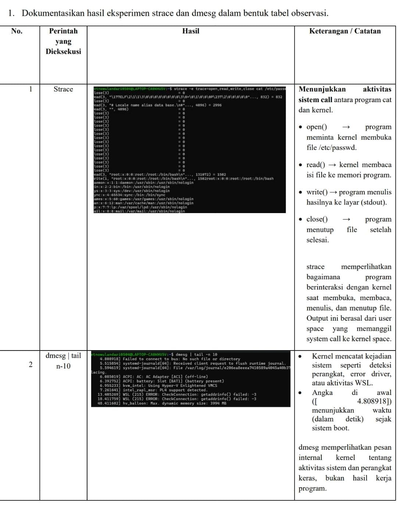
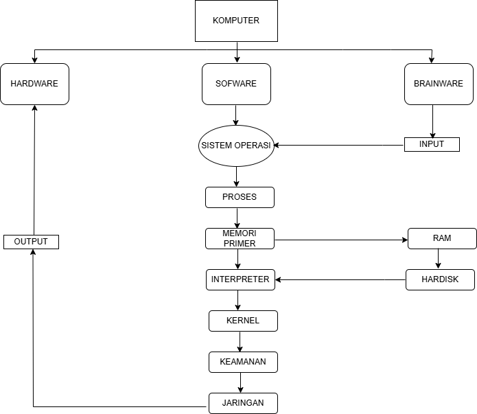

# Laporan Praktikum Minggu [2]
Topik:  "Syscall Structure"]

---

## Identitas
- **Nama**  : [Dyah Retno Wulandari]  
- **NIM**   : [250202934]  
- **Kelas** : [1IKRB]
 
---

## A. Deskripsi Singkat
Pada praktikum minggu ini, mahasiswa akan mempelajari **mekanisme system call dan struktur sistem operasi**.  
System call adalah antarmuka antara program aplikasi dan kernel yang memungkinkan aplikasi berinteraksi dengan perangkat keras secara aman melalui layanan OS.

Mahasiswa akan melakukan eksplorasi terhadap:
- Jenis-jenis system call yang umum digunakan (file, process, device, communication).
- Alur eksekusi system call dari mode user menuju mode kernel.
- Cara melihat daftar system call yang aktif di sistem Linux.

---

## B. Tujuan
Setelah menyelesaikan tugas ini, mahasiswa mampu:
1. Menjelaskan konsep dan fungsi system call dalam sistem operasi.
2. Mengidentifikasi jenis-jenis system call dan fungsinya.
3. Mengamati alur perpindahan mode user ke kernel saat system call terjadi.
4. Menggunakan perintah Linux untuk menampilkan dan menganalisis system call.

---

## C. Langkah Pengerjaan
1. **Setup Environment**
   - Gunakan Linux (Ubuntu/WSL).
   - Pastikan perintah `strace` dan `man` sudah terinstal.
   - Konfigurasikan Git (jika belum dilakukan di minggu sebelumnya).

2. **Eksperimen 1 – Analisis System Call**
   Jalankan perintah berikut:
   ```bash
   strace ls
   ```
   > Catat 5–10 system call pertama yang muncul dan jelaskan fungsinya.  
   Simpan hasil analisis ke `results/syscall_ls.txt`.

3. **Eksperimen 2 – Menelusuri System Call File I/O**
   Jalankan:
   ```bash
   strace -e trace=open,read,write,close cat /etc/passwd
   ```
   > Analisis bagaimana file dibuka, dibaca, dan ditutup oleh kernel.
   Jawab:
  - Membuka file (open)

   Kernel menerima permintaan dari program cat untuk membuka file /etc/passwd.
Kernel mencari file tersebut di sistem berkas, membuat file descriptor (biasanya nomor 3), lalu mengembalikannya ke proses.


- Membaca file (read)

Program cat meminta kernel membaca isi file melalui read(fd, buffer, size).
Kernel menyalin data dari page cache atau langsung dari disk ke memori proses, lalu mengembalikan jumlah byte yang dibaca (misalnya 1502 byte).

- Menulis ke layar (write)

Data hasil baca dikirim ke stdout (layar terminal) dengan write(1, buffer, size).
Kernel menyalin data dari memori proses ke perangkat terminal.

- Menutup file (close)

Setelah selesai, program memanggil close(fd).
Kernel menandai bahwa file descriptor tersebut tidak dipakai lagi dan melepaskan sumber dayanya.


4. **Eksperimen 3 – Mode User vs Kernel**
   Jalankan:
   ```bash
   dmesg | tail -n 10
   ```
   > Amati log kernel yang muncul. Apa bedanya output ini dengan output dari program biasa?

   Jawab : Output dmesg seperti yang kamu tampilkan berisi pesan internal dari kernel Linux tentang aktivitas sistem, sedangkan output program biasa adalah hasil dari program yang dijalankan oleh pengguna di user space, seperti menampilkan file atau teks.


5. **Diagram Alur System Call**
   - Buat diagram yang menggambarkan alur eksekusi system call dari program user hingga kernel dan kembali lagi ke user mode.
   - Gunakan draw.io / mermaid.
   - Simpan di:
     ```
     praktikum/week2-syscall-structure/screenshots/syscall-diagram.png
     ```

6. **Commit & Push**
   ```bash
   git add .
   git commit -m "Minggu 2 - Struktur System Call dan Kernel Interaction"
   git push origin main
   ```

---

## D. Tugas & Quiz
### Tugas
1. Dokumentasikan hasil eksperimen `strace` dan `dmesg` dalam bentuk tabel observasi. 

2. Buat diagram alur system call dari aplikasi → kernel → hardware → kembali ke aplikasi.  

3. Tulis analisis 400–500 kata tentang:
   # Mengapa system call penting untuk keamanan OS?  
 - Karena berfungsi sebagai gerbang penghubung antara program pengguna (user space) dan inti sistem operasi (kernel space). System call adalah mekanisme keamanan utama yang memastikan setiap interaksi antara program dan kernel berlangsung terkendali, tervalidasi, dan tercatat, sehingga melindungi OS dari penyalahgunaan atau serangan dari aplikasi pengguna.

- Kontrol Akses ke Kernel
System call membatasi interaksi langsung antara aplikasi dan kernel. Program bisa meminta layanan OS seperti membaca file atau mengirim data ke jaringan. Ini mencegah aplikasi jahat mengakses kernel secara langsung.

- Validasi dan Keamanan Input
Kernel memeriksa parameter yang dikirim oleh program sebelum mengeksekusi system call. Misalnya, OS memeriksa apakah proses memiliki hak akses untuk membaca file tertentu, sehingga mencegah akses ilegal.

- Isolasi antara User Space dan Kernel Space
Dengan memisahkan dua ruang ini, system call mencegah aplikasi di user space mengubah atau merusak memori kernel yang berisi kode dan data penting.

- Audit dan Logging Keamanan
Aktivitas system call dapat dipantau menggunakan alat seperti strace atau auditd, sehingga OS (dan administrator) bisa melacak perilaku mencurigakan seperti upaya akses tidak sah.

   # Bagaimana OS memastikan transisi user–kernel berjalan aman?

 - Memanfaatkan dukungan perangkat keras (CPU) — CPU otomatis mengubah mode eksekusi dan melompat ke alamat handler kernel yang telah ditentukan OS.
	Melakukan validasi parameter — kernel memeriksa setiap data, pointer, dan izin yang dikirim dari user space agar tidak mengakses memori kernel atau data ilegal.

-	Menggunakan tabel system call yang terlindungi — hanya fungsi-fungsi kernel yang sah dan terdaftar yang bisa dipanggil.

-	Mengembalikan kontrol dengan aman ke user mode — setelah system call selesai, CPU memastikan kembali ke user mode sehingga program tidak bisa tetap menjalankan kode kernel.

-	Control akses, OS menerapkan control akses wajib melalui kebijakan seperti Linux yang membatasi hak Istimewa bahkan untuk proses di mode kernel sehingga mengurangi resika hak istimewa

# Sebutkan contoh system
 call yang sering digunakan di Linux.  
Kontrol Proses

•	fork(): Membuat proses baru yang merupakan salinan dari proses yang memanggilnya. Ini adalah dasar untuk menjalankan program baru.

•	execve(): Mengganti citra proses saat ini dengan program yang baru. Biasanya digunakan setelah fork() untuk menjalankan program yang berbeda dari proses induk.

•	wait(): Menyebabkan proses induk menunggu hingga proses anak selesai.

•	exit(): Mengakhiri proses yang sedang berjalan dan mengembalikan kode status. 


Manajemen Berkas

•	open(): Membuka berkas dan mengembalikan file descriptor yang digunakan untuk operasi selanjutnya pada berkas tersebut.

•	read(): Membaca data dari file descriptor ke dalam sebuah buffer.

•	write(): Menulis data dari sebuah buffer ke file descriptor.

•	close(): Menutup file descriptor yang telah terbuka untuk melepaskan sumber daya yang terkait.

•	stat(): Mendapatkan informasi tentang berkas, seperti ukuran, waktu modifikasi, dan izin. 

Manajemen Informasi

•	getpid(): Mengembalikan ID proses (PID) dari proses yang sedang berjalan.

•	getppid(): Mengembalikan ID proses induk (PPID) dari proses yang sedang berjalan.

•	sleep(): Menyebabkan proses tertunda atau tidur untuk jangka waktu tertentu.

•	alarm(): Menjadwalkan alarm untuk mengirim sinyal setelah jumlah waktu tertentu. 

Manajemen Perangkat

•	ioctl(): Menangani operasi I/O tingkat rendah pada perangkat yang tidak dapat diakses melalui read() atau write(). 

Komunikasi Antar-proses (IPC) 

•	pipe(): Membuat saluran komunikasi satu arah antara dua proses.

•	socket(): Membuat titik akhir untuk komunikasi jaringan.

•	msgsnd() dan msgrcv(): Mengirim dan menerima pesan melalui antrean pesan.


4. Simpan semua hasil di:
   ```
   praktikum/week2-syscall-structure/
   ```

### Quiz
Jawab pertanyaan berikut di bagian **Quiz** laporan:
1. Apa fungsi utama system call dalam sistem operasi?  
Jawaban:
   Fungsi utama system call adalah sebagai antarmuka antara program dan sistem operasi untuk meminta layanan, seperti mengelola proses, berkas, perangkat keras, dan komunikasi antar proses
2. Sebutkan 4 kategori system call yang umum digunakan.  
   Jawaban: 

   a.	 Manajemen Proses: Mengontrol eksekusi dan multitasking program, termasuk membuat, menghentikan, dan menunda proses. 

   b.	Manajemen Berkas: Mengelola akses ke berkas, seperti membuat, membuka, membaca, menulis, dan menutupnya. 

   c.	Manajemen Perangkat: Mengizinkan program untuk mengakses dan berinteraksi dengan perangkat keras seperti printer, scanner, atau disk.

   d.	Manajemen Sumber Daya: Mengalokasikan dan membebaskan sumber daya seperti memori dan waktu CPU kepada proses

3. Mengapa system call tidak bisa dipanggil langsung oleh user program?

Jawab : System call tidak bisa dipanggil langsung oleh program user karena alasan keamanan, proteksi, dan manajemen sumber daya sistem operasi

---

## E. Output yang Diharapkan
- Hasil observasi system call (`strace ls`) dimasukkan ke dalam `laporan.md`.  
- File screenshot hasil observasi disimpan di `screenshots/syscall_ls.png`.  
- Diagram alur system call disimpan di `screenshots/syscall-diagram.png`.  
- Laporan lengkap berada di `laporan.md`.  
- Semua hasil telah di-*commit* ke GitHub tepat waktu.

---

## F. Referensi
1. Abraham Silberschatz, Peter Baer Galvin, Greg Gagne. *Operating System Concepts*, 10th Edition, Wiley, 2018.  
2. Andrew S. Tanenbaum, Herbert Bos. *Modern Operating Systems*, 4th Edition, Pearson, 2015.  
3. Linux Manual Pages (`man 2 syscalls`, `man strace`).  
4. OSTEP – *Operating Systems: Three Easy Pieces*, 2018.  
5. https://man7.org/linux/man-pages/man2/syscalls.2.html
