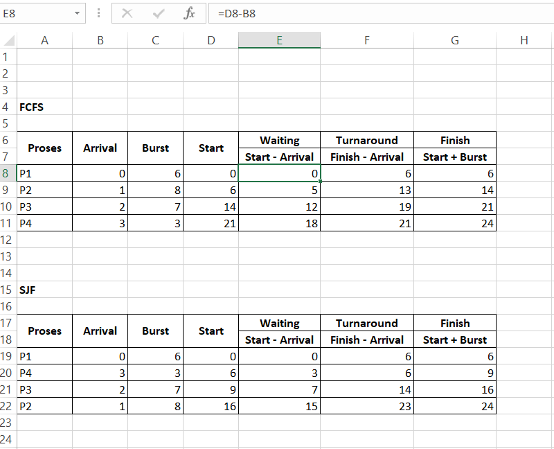

# Tugas Praktikum Minggu 5  
Topik: Penjadwalan CPU – FCFS dan SJF  
---

## Identitas
- **Nama**  : [Dyah Retno Wulandari]  
- **NIM**   : [250202934]  
- **Kelas** : [1IKRB]

---
## A. Deskripsi Singkat
Pada praktikum minggu ini, mahasiswa akan mempelajari **algoritma penjadwalan CPU (CPU Scheduling)** menggunakan dua pendekatan dasar:  
- **FCFS (First Come First Served)**  
- **SJF (Shortest Job First)**  

Tujuan utamanya adalah memahami bagaimana sistem operasi menentukan urutan eksekusi proses, serta bagaimana *waiting time* dan *turnaround time* memengaruhi performa sistem.

Mahasiswa akan melakukan simulasi dan perbandingan hasil perhitungan kedua algoritma ini menggunakan **tabel observasi manual atau spreadsheet (Excel/Google Sheets)** — tanpa perlu melakukan instalasi atau pemrograman tambahan.

---

## B. Tujuan
Setelah menyelesaikan tugas ini, mahasiswa mampu:
1. Menghitung *waiting time* dan *turnaround time* untuk algoritma FCFS dan SJF.  
2. Menyajikan hasil perhitungan dalam tabel yang rapi dan mudah dibaca.  
3. Membandingkan performa FCFS dan SJF berdasarkan hasil analisis.  
4. Menjelaskan kelebihan dan kekurangan masing-masing algoritma.  
5. Menyimpulkan kapan algoritma FCFS atau SJF lebih sesuai digunakan.  

---

## C. Langkah Pengerjaan
1. **Siapkan Data Proses**
   Gunakan tabel proses berikut sebagai contoh (boleh dimodifikasi dengan data baru):
   | Proses | Burst Time | Arrival Time |
   |:--:|:--:|:--:|
   | P1 | 6 | 0 |
   | P2 | 8 | 1 |
   | P3 | 7 | 2 |
   | P4 | 3 | 3 |

2. **Eksperimen 1 – FCFS (First Come First Served)**
   - Urutkan proses berdasarkan *Arrival Time*.  
       Jawab : P1 → P2 → P3 → P4

   - Hitung nilai berikut untuk tiap proses:
     ```
     Waiting Time (WT) = waktu mulai eksekusi - Arrival Time
     Turnaround Time (TAT) = WT + Burst Time
     ```

     Jawab :  
      Waiting Time (WT) = waktu mulai eksekusi - Arrival Time

       P1 = 0 - 0 = 0

       P2 = 6 - 1 = 5

       P3 = 14 - 2 = 12

       P4 = 21 - 3 = 18

      P1+P2+P3+P4 = 0 + 5 + 12 + 18 = 35

      Turnaround Time (TAT) = WT + Burst Time

        P1 = 0 + 6 = 6

        P2 = 5 + 8 = 13

        P3 = 12 + 7 = 19

        P4 = 18 + 3 = 21

        P1+P2+P3+P4 = 6 + 13 + 19 + 21 = 59

   - Hitung rata-rata Waiting Time dan Turnaround Time.

     Waiting Time (WT) = 35 / 4 = 8,75

     Rata-Rata Turnaround Time (TAT) =  59 / 4 = 14,75

   - Buat Gantt Chart sederhana:  
     ```
     | P1 | P2 | P3 | P4 |
     0    6    14   21   24
     ```

3. **Eksperimen 2 – SJF (Shortest Job First)**
   - Urutkan proses berdasarkan *Burst Time* terpendek (dengan memperhatikan waktu kedatangan).  

      Jawab : P1 → P4 → P3 → P2
    
   - Lakukan perhitungan WT dan TAT seperti langkah sebelumnya.  

      Jawab :
      Waiting Time (WT) = waktu mulai eksekusi - Arrival Time

      P1 = 0 - 0 = 0

      P4 = 6 - 3 = 9

      P3 = 9 - 2 = 7
      
      P2 = 16 - 1 = 15

      P1 + P4 + P3 + P2 = 0 + 9 + 7 + 15 = 25
   - Bandingkan hasil FCFS dan SJF pada tabel berikut:

     | Algoritma | Avg Waiting Time | Avg Turnaround Time | Kelebihan | Kekurangan |
     |------------|------------------|----------------------|------------|-------------|
     | FCFS | 8, 75 | 14, 75| Sederhana dan mudah diterapkan | Tidak efisien untuk proses panjang |
     | SJF | 6, 25 | 12, 25| Optimal untuk job pendek | Menyebabkan *starvation* pada job panjang |

4. **Eksperimen 3 – Visualisasi Spreadsheet (Opsional)**
   - Gunakan Excel/Google Sheets untuk membuat perhitungan otomatis:
     - Kolom: Arrival, Burst, Start, Waiting, Turnaround, Finish.
     - Gunakan formula dasar penjumlahan/subtraksi.
   - Screenshot hasil perhitungan dan simpan di:
     ```
     praktikum/week5-scheduling-fcfs-sjf/screenshots/

 

     ```

5. **Analisis**
   - Bandingkan hasil rata-rata WT dan TAT antara FCFS & SJF.  

      Jawab :
     
      - Average Waiting Time: FCFS = 8.75 vs SJF = 6.25 → SJF lebih baik

      - Average Turnaround Time: FCFS = 14.75 vs SJF = 12.25 → SJF lebih baik

      - Finish times sama untuk keseluruhan (semua job selesai pada t = 24)

   - Jelaskan kondisi kapan SJF lebih unggul dari FCFS dan sebaliknya.

      Jawab : 
      
      SJF lebih unggul di mana semua Burst Time sudah diketahui sebelumnya dan tujuannya adalah meminimalkan waktu tunggu rata-rata.
   
      FCFS (First Come First Served) lebih unggul ketika semua proses memiliki Burst Time yang relatif sama atau perbedaan waktu kedatangan sangat signifikan.
      
      Dari hasil ini tabel rata-rata, SJF lebih efisien karena Burst Time antar proses berbeda cukup jauh (3–8).
  
   - Tambahkan kesimpulan singkat di akhir laporan.

      Jawab :

      SJF (non-preemptive) menghasilkan waktu tunggu rata-rata dan turnaround rata-rata lebih kecil dibanding FCFS artinya lebih efisien dari sisi rata-rata.

      Jika tujuannya adalah meminimalkan waktu tunggu rata-rata, pilih SJF. Tetapi,  jika tujuannya fairness dan kesederhanaan pilih FCFS.
      FCFS (First Come First Served) dianggap lebih fair (adil) karena proses yang datang lebih dulu akan dikerjakan lebih dulu, tanpa memandang panjang atau pendeknya waktu eksekusi. SJF (Shortest Job First) bisa kurang fair, karena proses yang lama (Burst Time besar) bisa terus tertunda  yang disebut starvation (kelaparan).

6. **Commit & Push**
   ```bash
   git add .
   git commit -m "Minggu 5 - CPU Scheduling FCFS & SJF"
   git push origin main
   ```

---

## D. Tugas & Quiz
### Tugas
1. Hitung *waiting time* dan *turnaround time* dari minimal 2 skenario FCFS dan SJF.  
2. Sajikan hasil perhitungan dalam tabel perbandingan (FCFS vs SJF).  
3. Analisis kelebihan dan kelemahan tiap algoritma.  
Jawab : 

   **FCFS (First Come First Served)**

   **Kelebihan** : Sederhana dan mudah diimplementasikan, serta adil: proses dilayani sesuai urutan kedatangan.

   **Kelemahan** : Waktu tunggu bisa lama untuk proses pendek jika di belakang proses panjang (efek convoy) dan tidak efisien untuk sistem interaktif.

   **SJF (Shortest Job First)**

   **Kelebihan**: Memberikan rata-rata waktu tunggu minimum dan efisien untuk sistem batch.

   **Kelemahan** :Harus tahu waktu eksekusi tiap proses (tidak realistis kadang) dan bisa menimbulkan kelaparan (starvation) bagi proses panjang.

4. Simpan seluruh hasil dan analisis ke `laporan.md`.  

### Quiz
Tuliskan jawaban di bagian **Quiz** pada laporan:
1. Apa perbedaan utama antara FCFS dan SJF?  
   Jawab: **FCFS** mengutamakan urutan kedatangan, proses yang datang lebih dulu dieksekusi lebih dulu, sederhana dan mudah diimplementasikan serta bisa terjadi proses pendek menunggu proses panjang selesai. 
   
   Sedangkan **SJF** mengutamakan durasi proses terpendek untuk meminimalkan waktu tunggu rata-rata, proses dengan waktu eksekusi paling pendek dieksekusi lebih dulu, membutuhkan perkiraan burst time yang akurat dan sulit diterapkan pada sistem nyata, serta waktu tunggu rata-rata bisa menjadi paling kecil (optimal).
2. Mengapa SJF dapat menghasilkan rata-rata waktu tunggu minimum? 

   Jawab : Karena proses singkat selesai cepat → mengurangi antrean, total penjumlahan waktu tunggu seluruh proses menjadi minimum dan  terbukti secara matematis sebagai strategi optimal untuk meminimalkan total waktu tunggu (bukti formal dikenal dalam teori “Shortest Remaining Time First” untuk versi preemptive). 
3. Apa kelemahan SJF jika diterapkan pada sistem interaktif?  
   Jawab : SJF tidak cocok untuk sistem interaktif karena sistem ini memerlukan reaksi cepat dan penjadwalan adaptif, bukan hanya efisiensi waktu tunggu rata-rata.

---

## E. Output yang Diharapkan
- Hasil observasi dan perhitungan dimasukkan ke dalam `laporan.md`.  
- Screenshot tabel atau Gantt Chart disimpan di `screenshots/`.  
- Laporan lengkap berada di `laporan.md`.  
- Semua hasil telah di-*commit* ke GitHub tepat waktu.  

---

## F. Referensi
1. Abraham Silberschatz, Peter Baer Galvin, Greg Gagne. *Operating System Concepts*, 10th Edition, Wiley, 2018.  
2. Andrew S. Tanenbaum, Herbert Bos. *Modern Operating Systems*, 4th Edition, Pearson, 2015.  
3. OSTEP – *Operating Systems: Three Easy Pieces*, 2018.  
4. Linux Manual Pages – *Scheduling & Process Control*.  