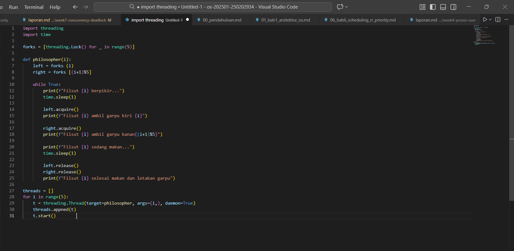
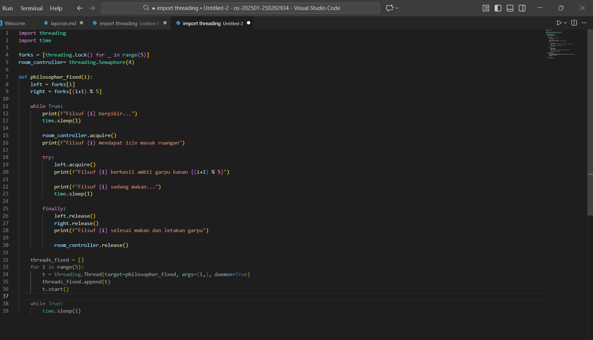

# Tugas Praktikum Minggu 7  
Topik: Sinkronisasi Proses dan Masalah Deadlock  

---

## Identitas
- **Nama**  : 

1. Latifah Risti Anggraeni (250202945) / [Ketua & Analisis]

2. Nisa'ul Hidayah (250202981) / [Simulasi]

3. Dyah Retno Wulandari (250202934) / [Bagian Dokumentasi]
- **Kelas** : [1IKRB]

---

### A. Deskripsi Singkat
Pada praktikum minggu ini, mahasiswa akan mempelajari **mekanisme sinkronisasi proses dan penanganan deadlock** dalam sistem operasi.  
Tujuan utamanya adalah memahami bagaimana beberapa proses dapat berjalan secara bersamaan (concurrent) tanpa menyebabkan konflik data atau kebuntuan sumber daya (*deadlock*).

Mahasiswa akan melakukan studi kasus berbasis **Dining Philosophers Problem**, yaitu permasalahan klasik sinkronisasi yang menggambarkan bagaimana proses harus berbagi sumber daya terbatas (chopstick, mutex, semaphore) tanpa menimbulkan deadlock.  

Eksperimen ini dilakukan secara berkelompok, difokuskan pada:
- Analisis kondisi terjadinya deadlock.
- Implementasi solusi sinkronisasi menggunakan *semaphore* atau *monitor*.
- Dokumentasi perbandingan versi deadlock dan versi fixed.

---

## B. Tujuan
Setelah menyelesaikan tugas ini, mahasiswa mampu:
1. Mengidentifikasi empat kondisi penyebab deadlock (*mutual exclusion, hold and wait, no preemption, circular wait*).  
2. Menjelaskan mekanisme sinkronisasi menggunakan *semaphore* atau *monitor*.  
3. Menganalisis dan memberikan solusi untuk kasus deadlock.  
4. Berkolaborasi dalam tim untuk menyusun laporan analisis.  
5. Menyajikan hasil studi kasus secara sistematis.  

---

## C. Langkah Pengerjaan
1. **Persiapan Tim**
   - Bentuk kelompok beranggotakan 3–4 orang.  
   - Tentukan ketua dan pembagian tugas (analisis, implementasi, dokumentasi).

2. **Eksperimen 1 – Simulasi Dining Philosophers (Deadlock Version)**
   - Implementasikan versi sederhana dari masalah *Dining Philosophers* tanpa mekanisme pencegahan deadlock.  
   - Contoh pseudocode:
     ```text
     while true:
       think()
       pick_left_fork()
       pick_right_fork()
       eat()
       put_left_fork()
       put_right_fork()
     ```
   - Jalankan simulasi atau analisis alur (boleh menggunakan pseudocode atau diagram alur).  
   - Identifikasi kapan dan mengapa deadlock terjadi.

3. **Eksperimen 2 – Versi Fixed (Menggunakan Semaphore / Monitor)**
   - Modifikasi pseudocode agar deadlock tidak terjadi, misalnya:
     - Menggunakan *semaphore (mutex)* untuk mengontrol akses.
     - Membatasi jumlah filosof yang dapat makan bersamaan (max 4).  
     - Mengatur urutan pengambilan garpu (misal, filosof terakhir mengambil secara terbalik).  
   - Analisis hasil modifikasi dan buktikan bahwa deadlock telah dihindari.

   **Jawab :** 

   Modifikasi yang memperkenalkan room_controller (Semaphore dengan nilai $N-1$, yaitu 4) berhasil mencegah deadlock secara efektif.

   Mekanisme PencegahanPembatasan Akses: Semaphore (room_controller) bertindak sebagai pelayan yang membatasi hanya maksimal 4 filsuf yang boleh berada di meja (mencoba mengambil garpu) secara bersamaan

   Pemecah Siklus (Circular Wait): Dengan hanya mengizinkan $N-1$ filsuf untuk mencoba makan, selalu ada setidaknya satu garpu bebas yang tidak dapat ditahan oleh semua filsuf secara kolektif.

   Jaminan Kemajuan: Keterbatasan ini menjamin bahwa filsuf terakhir yang masuk (misalnya $P_3$, jika 4 filsuf sudah masuk) pasti dapat mengambil kedua garpunya ($F_3$ dan $F_4$ dalam contoh ini) tanpa menunggu garpu yang ditahan oleh filsuf lain. 

   Setelah filsuf ini selesai, ia melepaskan garpu, memecah rantai tunggu yang ada, dan memungkinkan filsuf lain untuk melanjutkan. Dengan demikian, kondisi Circular Wait dihilangkan, yang merupakan syarat mutlak untuk mencegah deadlock.

4. **Eksperimen 3 – Analisis Deadlock**
   - Jelaskan empat kondisi deadlock dari versi pertama dan bagaimana kondisi tersebut dipecahkan pada versi fixed.  
         Jawab : Empat kondisi deadlock pada eksperimen pertama

   1. Mutual Exclusion (Mutual Eksklusif)
Setiap garpu hanya bisa dipakai oleh satu filsuf pada satu waktu.
Pada versi pertama, lock membuat garpu hanya dimiliki satu thread.

   2. Hold and Wait
Setiap filsuf memegang satu garpu kiri dan kemudian menunggu garpu kanan.
Semua filsuf memegang garpu kiri dan sama-sama menunggu garpu kanan(terjebak).

   3. No Preemption (Tidak Bisa Dipaksa Lepas)
Lock tidak bisa dicabut paksa, jika filsuf menunggu, dia harus menunggu sampai garpu dilepas.
Tidak ada mekanisme untuk memaksa seorang filsuf melepaskan garpu.

   4. Circular Wait (Menunggu Secara Melingkar)

      filsuf 0 menunggu garpu 1,

      filsuf 1 menunggu garpu 2,

      filsuf 4 menunggu garpu 0.
Terjadi rantai menunggu melingkar sehingga semua macet.

   Pada versi fixed menggunakan semaphore(4) untuk membatasi bahwa hanya 4 filsuf yang boleh mencoba makan pada waktu yang sama.

   - Sajikan hasil analisis dalam tabel seperti contoh berikut:

     | Kondisi Deadlock | Terjadi di Versi Deadlock | Solusi di Versi Fixed |
     |------------------|---------------------------|------------------------|
     | Mutual Exclusion | Ya. (Garpu hanya dapat digunakan 1 filsut dalam satu waktu.) | Tetap ada (mutual exclusion tidak dihilangkan). Namun dikontrol melalui semaphore pada setiap garpu untuk akses aman |
     | Hold and Wait | Ya. Filsuf memegang 1 garpu (hold) dan menunggu garpu lainnya (menunggu). | Dibatasi dengan semaphore room = 4 sehingga tidak semua filsuf bisa menunggu secara bersamaan → kondisi hold-and-wait penuh tidak terjadi. |
     | No Preemption | Ya. Garpu tidak bisa direbut paksa, hanya dilepas saat selesai makan. |Tetap. Tidak ada preemption. Namun tidak menyebabkan deadlock karena kondisi circular wait dihilangkan. |
     | Circular Wait | Ya. Semua filsuf bisa membentuk siklus: P0 menunggu P1, …, P4 menunggu P0. | Dihilangkan melalui: 1) batasi maksimum 4 filsuf, atau 2) modifikasi urutan pengambilan (filsuf terakhir mengambil garpu secara terbalik), sehingga siklus tidak pernah terbentuk.|

# Kesimpulan :

   Pada versi fixed, strategi sinkronisasi ditambahkan dengan semaphore untuk membatasi jumlah filsuf (maks. 4) atau mengubah urutan pengambilan garpu (asymmetric order). Modifikasi ini menghilangkan kondisi Circular Wait, dan sekaligus mengurangi Hold and Wait penuh, sehingga rantai deadlock terputus.

5. **Eksperimen 4 – Dokumentasi**
   - Simpan semua diagram, screenshot simulasi, dan hasil diskusi di:
     ```
     praktikum/week7-concurrency-deadlock/screenshots/
Eksperimen 1
   

Eksperimen 2
   

     ```
   - Tuliskan laporan kelompok di `laporan.md` (format IMRaD singkat: *Pendahuluan, Metode, Hasil, Analisis, Diskusi*).

6. **Commit & Push**
   ```bash
   git add .
   git commit -m "Minggu 7 - Sinkronisasi Proses & Deadlock"
   git push origin main
   ```

---

## D. Tugas & Quiz
### Tugas
1. Analisis versi *Dining Philosophers* yang menyebabkan deadlock dan versi fixed yang bebas deadlock.  
2. Dokumentasikan hasil diskusi kelompok ke dalam `laporan.md`.  
3. Sertakan diagram atau screenshot hasil simulasi/pseudocode.  
4. Laporkan temuan penyebab deadlock dan solusi pencegahannya.  

### Quiz
Tuliskan jawaban di bagian **Quiz** laporan:
1. Sebutkan empat kondisi utama penyebab deadlock.

   Jawab: 
   
      - Mutual Exclusion

      - Hold dan Wait

      - No Preemption

      - Circular Wait
2. Mengapa sinkronisasi diperlukan dalam sistem operasi?  

   Jawab : Sinkronisasi diperlukan untuk mencegah inkonsistensi data dan sinkronisasi mengatur jalannya beberapa proses secara bersamaan untuk memastikan urutan eksekusi yang tepat, tanpa sinkronisasi akses bersamaan ke sumber daya bersama dapat menyebabkan data yang tidak konsistensi atau hasil yang tidak terduga.
3. Jelaskan perbedaan antara *semaphore* dan *monitor*.

   Jawab: 
   - Semaphore adalah variabel integer yang digunakan untuk mengontrol akses ke sumber daya bersama melalui operasi wait dan signal
   - Monitir adalahkonstruksi sinkronisasi tingkat tinggi yang mengelompokkan data bersama dan prosedur yang beroperasi, memastikan hanya satu proses yang aktif di dalam monitor pada satu waktu.

---

## E. Output yang Diharapkan
- Laporan analisis kelompok dalam `laporan.md`.  
- Screenshot hasil simulasi atau pseudocode disimpan di `screenshots/`.  
- Tabel analisis kondisi deadlock dan solusinya.  
- Semua hasil telah di-*commit* ke GitHub tepat waktu.  

---

## F. Referensi
1. Abraham Silberschatz, Peter Baer Galvin, Greg Gagne. *Operating System Concepts*, 10th Edition, Wiley, 2018.  
2. Andrew S. Tanenbaum, Herbert Bos. *Modern Operating Systems*, 4th Edition, Pearson, 2015.  
3. OSTEP – *Operating Systems: Three Easy Pieces*, 2018.  
4. Edsger Dijkstra. *Cooperating Sequential Processes* (1968).  
5. Linux Manual Pages – *Semaphores, Mutexes, and Threads*.  
