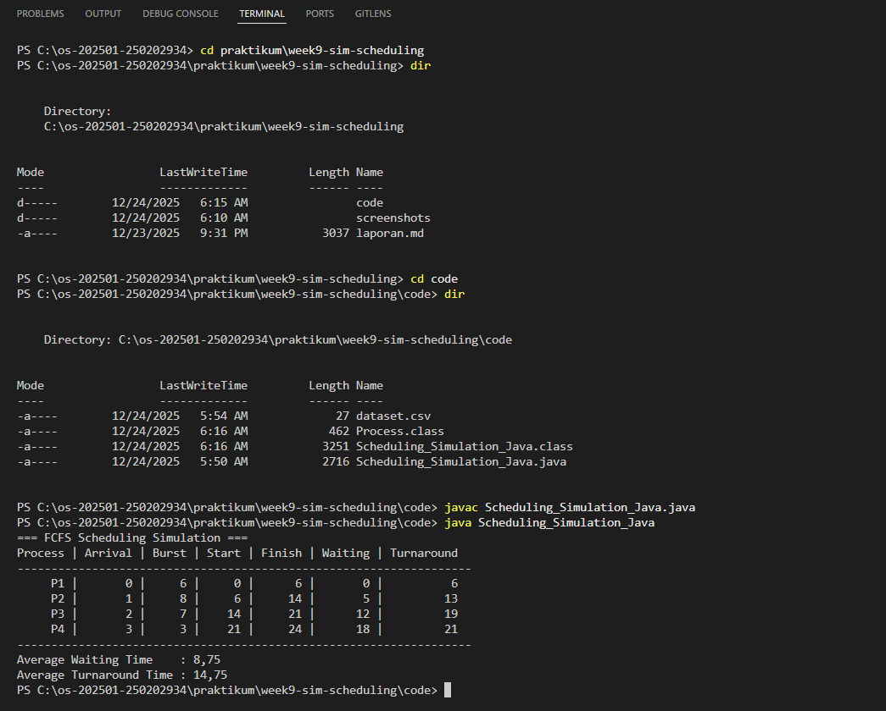

# Tugas Praktikum Minggu 9  
Topik: Simulasi Algoritma Penjadwalan CPU  

---
## Identitas
- **Nama**  : [Dyah Retno Wulandari]  
- **NIM**   : [250202934]  
- **Kelas** : [1IKRB]


## A. Deskripsi Singkat
Pada praktikum minggu ini, mahasiswa akan **mengimplementasikan program simulasi sederhana algoritma penjadwalan CPU**, khususnya **FCFS dan SJF**.  
Berbeda dengan Minggu 5–6 yang berfokus pada perhitungan manual, pada minggu ini mahasiswa mulai **mengotomatisasi perhitungan menggunakan program**, menjalankan dataset uji, serta menyajikan hasil dalam bentuk tabel atau grafik.

Praktikum ini menjadi jembatan antara **pemahaman konseptual** dan **implementasi komputasional** algoritma sistem operasi.

---

## B. Tujuan
Setelah menyelesaikan tugas ini, mahasiswa mampu:
1. Membuat program simulasi algoritma penjadwalan FCFS dan/atau SJF.  
2. Menjalankan program dengan dataset uji yang diberikan atau dibuat sendiri.  
3. Menyajikan output simulasi dalam bentuk tabel atau grafik.  
4. Menjelaskan hasil simulasi secara tertulis.  
5. Mengunggah kode dan laporan ke Git repository dengan rapi dan tepat waktu.

---

## C. Ketentuan Teknis
- Bahasa pemrograman **bebas** (Python / C / Java / lainnya).  
- Tidak wajib GUI, cukup **program berbasis terminal**.  
- Fokus penilaian pada **logika algoritma dan keakuratan hasil**, bukan kompleksitas bahasa.

Struktur folder (sesuaikan dengan template repo):
```
praktikum/week9-sim-scheduling/
├─ code/
│  ├─ scheduling_simulation.*
│  └─ dataset.csv
├─ screenshots/
│  └─ hasil_simulasi.png
└─ laporan.md
```

---

## D. Langkah Pengerjaan
1. **Menyiapkan Dataset**

   Buat dataset proses minimal berisi:

   | Proses | Arrival Time | Burst Time |
   |:--:|:--:|:--:|
   | P1 | 0 | 6 |
   | P2 | 1 | 8 |
   | P3 | 2 | 7 |
   | P4 | 3 | 3 |

2. **Implementasi Algoritma**

   Program harus:
   - Menghitung *waiting time* dan *turnaround time*.  
   - Mendukung minimal **1 algoritma (FCFS atau SJF non-preemptive)**.  
   - Menampilkan hasil dalam tabel.

3. **Eksekusi & Validasi**

   - Jalankan program menggunakan dataset uji.  
   - Pastikan hasil sesuai dengan perhitungan manual minggu sebelumnya.  
   - Simpan hasil eksekusi (screenshot).

      
4. **Analisis**

   - Jelaskan alur program.  
   - Bandingkan hasil simulasi dengan perhitungan manual.  
   - Jelaskan kelebihan dan keterbatasan simulasi.

         import java.io.*;
         
         import java.util.*;

         class Process {
         String id;
         int arrivalTime;
         int burstTime;
         int startTime;
         int finishTime;
         int waitingTime;
         int turnaroundTime;

         Process(String id, int arrivalTime, int burstTime) {
            this.id = id;
            this.arrivalTime = arrivalTime;
            this.burstTime = burstTime;
         }
            }

            public class Scheduling_Simulation_Java {

         public static void main(String[] args) {
            List<Process> processes = new ArrayList<>();

            // Membaca dataset.csv
            try {
                  BufferedReader br = new BufferedReader(new FileReader("dataset.csv"));
                  String line;

                  while ((line = br.readLine()) != null) {
                     String[] data = line.split(",");
                     processes.add(new Process(
                              data[0],
                              Integer.parseInt(data[1]),
                              Integer.parseInt(data[2])
                     ));
                  }
                  br.close();
            } catch (IOException e) {
                  System.out.println("Gagal membaca dataset.csv");
                  return;
            }

            // Urutkan berdasarkan arrival time (FCFS)
            processes.sort(Comparator.comparingInt(p -> p.arrivalTime));

            int currentTime = 0;
            double totalWaiting = 0;
            double totalTurnaround = 0;

            System.out.println(" FCFS Scheduling Simulation ");
            System.out.println("Process | Arrival | Burst | Start | Finish | Waiting | Turnaround");
            System.out.println("-------------------------------------------------------------------");

            for (Process p : processes) {
                  if (currentTime < p.arrivalTime) {
                     currentTime = p.arrivalTime;
                  }

                  p.startTime = currentTime;
                  p.finishTime = p.startTime + p.burstTime;
                  p.waitingTime = p.startTime - p.arrivalTime;
                  p.turnaroundTime = p.finishTime - p.arrivalTime;

                  currentTime = p.finishTime;

                  totalWaiting += p.waitingTime;
                  totalTurnaround += p.turnaroundTime;

                  System.out.printf("%7s | %7d | %5d | %5d | %6d | %7d | %10d%n",
                        p.id, p.arrivalTime, p.burstTime,
                        p.startTime, p.finishTime,
                        p.waitingTime, p.turnaroundTime);
            }

            System.out.println("-------------------------------------------------------------------");
            System.out.printf("Average Waiting Time    : %.2f%n", totalWaiting / processes.size());
            System.out.printf("Average Turnaround Time : %.2f%n", totalTurnaround / processes.size());
         }
            }


*Alur program :*

- Pertama buat membuat struktur data proses disimpan di class process
- Kedua membaca data dari file dataset.csv yang setiap baris berisi ID proses, arrival time, burst time serta data dibaca dan dimasukkan ke dalam objek process
- Kemudian mengurutkan proses (FCFS) diurutkan berdasarkan waktu kedatangan paling awal
- Selanjutnya simulasi penjdawalan CPU untuk mengekseskusi program satu per satu sesuai urutan FCFS untuk menhitung : start time, finish time, waiting time, turnaround time
- Setelah itu menampilkan hasil simulasi tiap proses sampai dengan menghitung hasil rata-rata

*Kelebihan simulasi menggunakan program java:*

a. Hasil perhitungan akurat dan konsisten
b. Dapat menangani banyak data

*Keterbatasan simulasi menggunakan program java:*
Membutuhkan pemahaman dasar pemrograman
5. **Commit & Push**

   ```bash
   git add .
   git commit -m "Minggu 9 - Simulasi Scheduling CPU"
   git push origin main
   ```

---

## E. Tugas & Quiz
### Tugas
1. Buat program simulasi FCFS atau SJF.  
2. Jalankan program dengan dataset uji.  
3. Sajikan output dalam tabel atau grafik.  
4. Tulis laporan praktikum pada `laporan.md`.

### Quiz
Jawab pada bagian **Quiz** di laporan:
1. Mengapa simulasi diperlukan untuk menguji algoritma scheduling?  

Jawab : Karena memungkinkan pengujian algoritma scheduling secara aman, mudah membandingkan banyak algoritma menjadi objektif, dapat mengontrol berbagai akses skenario estrem, serta memudahkan analisis dan pemahaman kinerja algoritma sebelum diterapkan pada sistem nyata.

2. Apa perbedaan hasil simulasi dengan perhitungan manual jika dataset besar?

Jawab : 
-	Hasil simulasi lebih akurat, konsisten, dan layak digunakan untuk dataset besar
-	Perhitungan manual tetap penting untuk pemahaman kosep dan verifikasi logika pada dataset kecil, tetapi tidak efektif untuk evaluasi perfoma skala besar.

3. Algoritma mana yang lebih mudah diimplementasikan? Jelaskan.

Jawab: 
-	FCFS (First Come First Served) karena proses dieksekusi sesuai urutan kedatangan tanpa perhitungan tambahan seperti prioritas atau time quantum
-	Tidak ada pre-emption setelah proses mendapat CPU, proses berjalan sampai selesai dan membuat implementasi logika sangat sederhana dan minim context switching
-	Mudah disimulasikan dan dihitung manual berdasarkan arrival time lalu menghitung waktu tunggu secara berurutan


---

## F. Output yang Diharapkan
- Kode program simulasi di folder `code/`.  
- Dataset uji di `code/dataset.csv`.  
- Screenshot hasil eksekusi di `screenshots/`.  
- Laporan lengkap di `laporan.md`.  
- Semua hasil telah di-*commit* ke GitHub.

---

## G. Referensi
1. Silberschatz, A., Galvin, P., Gagne, G. *Operating System Concepts*, 10th Ed.  
2. Tanenbaum, A. *Modern Operating Systems*, 4th Ed.  
3. OSTEP – Scheduling.
